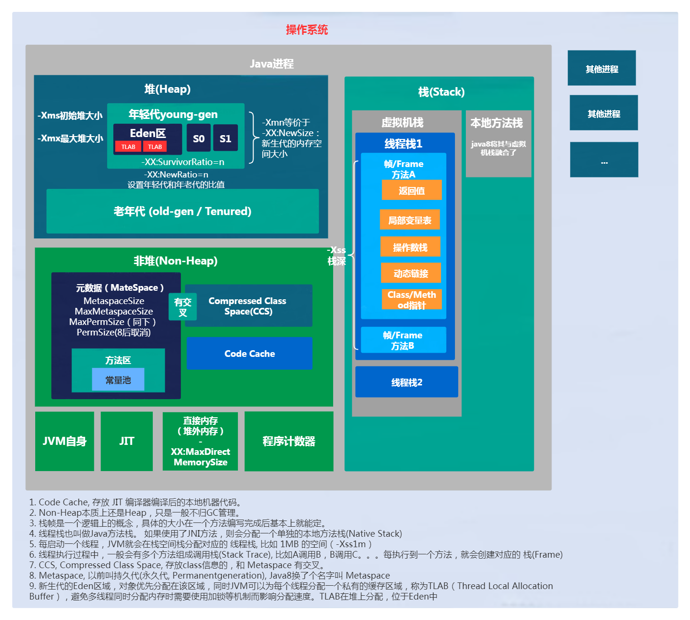

## 学习笔记

### 学习目标：
1. JVM 基础知识、Java 字节码技术、JVM 类加载器、JVM 内存模型、JVM 启动参数详解；
2. JDK 内置命令行工具、JDK 内置图形界面工具、JDWP 简介、JMX 与相关工具；
3. 常见的 JVM GC 算法（Parallel GC/CMS GC/G1 GC）基本原理和特点；
4. 新一代 GC 算法（Java11 ZGC/Java12 Shenandoah) 和 Oracle GraalVM；
5. GC 日志解读与分析、JVM 的线程堆栈等数据分析、内存 dump 和内存分析工具；
6. fastThread 相关工具以及面临复杂问题时的几个高级工具的使用；
7. JVM 问题排查分析的常用手段、性能调优的最佳实践经验等；
8. JVM 相关的常见面试问题必知必会、全面分析。

### 学习总结：

[jvm总结：jvm启动参数与命令行工具](jvm启动参数与命令行工具.md)

[GC总结：gc算法与常见gc组合分析](gc算法与常见gc组合分析.md)

### 作业：
- [x] 1、自己写一个简单的Hello.java，里面需要涉及基本类型，四则运行，if和for，然后自己分析一下对应的字节码，有问题群里讨论。
```java
/**
 * @author yangxing
 * @version 1.0
 * @date 2020/10/16 0016 14:09
 */
public class TestByte {

    private static int a = 99;
    private static final int b = 100;

    public static void main(String[] args) {
        TestByte demo = new TestByte();
        long x = 5;
        long y = 10;
        long z = x + y;
        int res = demo.add(a,b);
        for (int i = 0; i < res; i++) {
            if (i < 2){
                System.out.println("结果：" + i * 2);
            }
        }
    }

    private int add(int a,int b){
        return a + b;
    }

}
```
- [x] 2、自定义一个Classloader，加载一个Hello.xlass文件，执行hello方法，此文件内容是一个Hello.class文件所有字节(x=255-x)处理后的文件。文件群里提供。
```java
**
 * @author yangxing
 * @version 1.0
 * @date 2020/10/16 0016 14:51
 */
public class ClassLoad2 extends ClassLoader {

    public static void main(String [] args) throws Exception{
        ClassLoad2 myloader = new ClassLoad2();
        String path = ClassLoad2.class.getClassLoader().getResource("classloadTest/Hello.xlass").getPath();
        Class c = myloader.findClass(path);
        Object obj = c.newInstance();
        System.out.println("类名：" + obj.getClass().getName());
        Method m = c.getMethod("hello");
        m.invoke(obj);
    }

    @Override
    protected Class<?> findClass(String name){
        byte[] b = null;
        try {
            b = getByte(name);
        } catch (IOException e) {
            e.printStackTrace();
        }
        return defineClass(null, b, 0, b.length);
    }

    private byte[] getByte(String name) throws IOException {
        FileInputStream in = new FileInputStream(name);
        byte[] b = new byte[1024];
        ByteArrayOutputStream out = new ByteArrayOutputStream();
        int len = 0;
        while((len = in.read(b)) != -1){
            out.write(b, 0, len);
        }
        out.close();
        b = out.toByteArray();
        for (int i = 0; i < b.length; i++) {
            b[i] = (byte) (255 - b[i]);
        }
        return b;
    }
}
```
- [x] 3、画一张图，展示Xmx、Xms、Xmn、Meta、DirectMemory、Xss这些内存参数的关系。

- [x] 4、检查一下自己维护的业务系统的JVM参数配置，用jstat和jstack、jmap查看一下详情，并且自己独立分析一下大概情况，思考有没有不合理的地方，如何改进。
