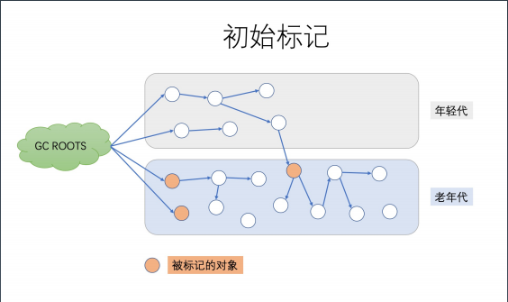
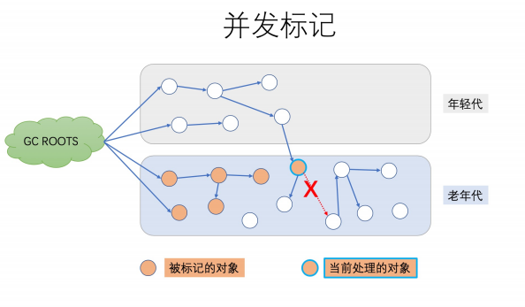
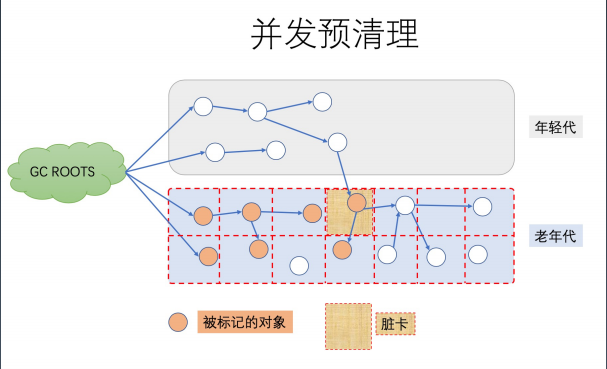
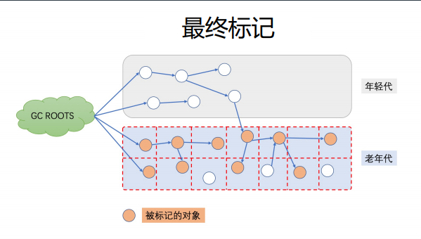
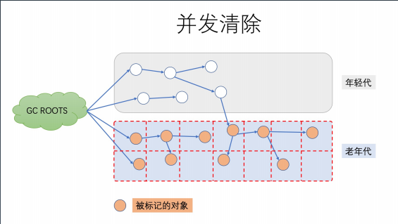
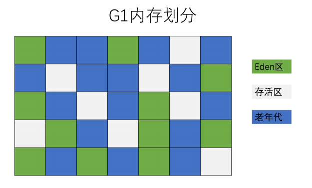
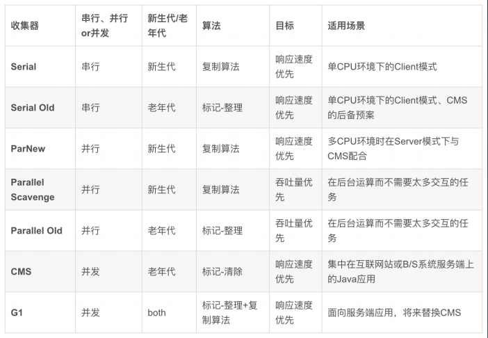
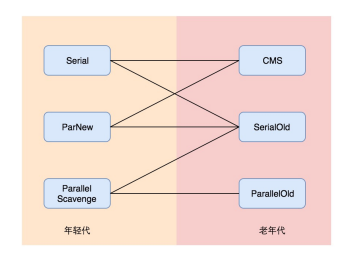

## GC
### 1. 为什么会有 GC
> 本质上是内存资源的有限性，因此需要大家共享使用，手工申请，手动释放。

### 2. 名词解释
- Minor GC：新生代GC，指发生在新生代的垃圾收集动作，所有的Minor GC都会触发全世界的暂停（stop-the-world），停止应用程序的线程，不过这个过程非常短暂。
- Major GC/Full GC：老年代GC，指发生在老年代的GC。

### 3. 常见的GC算法
#### - 引用计数法 Reference Counting
给对象添加一个引用计数器，每过一个引用计数器值就+1，少一个引用就-1。当它的引用变为0时，该对象就不能再被使用。它的实现简单，但是不能解决互相循环引用的问题。
#### - 根搜索算法 GC Roots Tracing
以一系列叫“GC Roots”的对象为起点开始向下搜索，走过的路径称为引用链（Reference Chain），当一个对象没有和任何引用链相连时，证明此对象是不可用的，用图论的说法是不可达的。那么它就会被判定为是可回收的对象。
>JAVA里可作为GC Roots的对象
- 虚拟机栈（栈帧中的本地变量表）中引用的对象
- 活动线程（Active threads）
- 方法区中的类静态属性引用的对象
- 方法区中的常量引用的对象
- 本地方法栈中JNI（即Native方法）的引用的对象
#### - 标记-清除算法 Mark-Sweep
这是一个非常基本的GC算法，它是现代GC算法的思想基础，分为标记和清除两个阶段：
  1. Marking（标记）: 遍历所有的可达对象，并在本地内存(native)中分门别类记下。
  2. Sweeping（清除）: 这一步保证了，不可达对象所占用的内存，在之后进行内存分配时可以重用。

但是它有两个问题，一是效率问题，两个过程的效率都不高。二是空间问题，清除之后会产生大量不连续的内存。

#### - 复制算法 Copying
复制算法是将原有的内存空间分成两块，每次只使用其中的一块。在GC时，将正在使用的内存块中的存活对象复制到未使用的那一块中，然后清除正在使用的内存块中的所有对象，并交换两块内存的角色，完成一次垃圾回收。它比标记-清除算法要高效，但不适用于存活对象较多的内存，因为复制的时候会有较多的时间消耗。它的致命缺点是会有一半的内存浪费。

#### - 标记整理算法 Mark-Compact
标记整理算法适用于存活对象较多的场合，它的标记阶段和标记-清除算法中的一样。整理阶段是将所有存活的对象压缩到内存的一端，之后清理边界外所有的空间。它的效率也不高。

### 4. JVM分别对新生代和老年代采用不同的垃圾回收机制。

GC触发条件：Eden区满了触发Minor GC，这时会把Eden区存活的对象复制到Survivor区，当对象在Survivor区熬过一定次数的Minor GC之后，就会晋升到老年代（当然并不是所有的对象都是这样晋升的到老年代的），当老年代满了，就会报OutofMemory异常。

#### 新生代的GC（Minor GC）：

新生代通常存活时间较短基于Copying算法进行回收，所谓Copying算法就是扫描出存活的对象，并复制到一块新的完全未使用的空间中，对应于新生代，就是在Eden和FromSpace或ToSpace之间copy。新生代采用空闲指针的方式来控制GC触发，指针保持最后一个分配的对象在新生代区间的位置，当有新的对象要分配内存时，用于检查空间是否足够，不够就触发GC。当连续分配对象时，对象会逐渐从Eden到Survivor，最后到老年代。

老年代与新生代不同，老年代对象存活的时间比较长、比较稳定，因此采用标记(Mark)算法来进行回收，所谓标记就是扫描出存活的对象，然后再进行回收未被标记的对象，回收后对用空出的空间要么进行合并、要么标记出来便于下次进行分配，总之目的就是要减少内存碎片带来的效率损耗。

### 5. 串行GC(SerialGC)和并行GC(ParNew)
1. 串行 GC（Serial GC）/ParNewGC

-XX：+UseSerialGC 配置串行 GC
- 串行 GC 对年轻代使用 mark-copy（标记-复制） 算法，对老年代使用 mark-sweep-compact
（标记-清除-整理）算法。
- 两者都是单线程的垃圾收集器，不能进行并行处理，所以都会触发全线暂停（STW），停止所
有的应用线程。
- 因此这种 GC 算法不能充分利用多核 CPU。不管有多少 CPU 内核，JVM 在垃圾收集时都只能使
用单个核心。
- CPU 利用率高，暂停时间长。简单粗暴，就像老式的电脑，动不动就卡死
- -XX：+USeParNewGC 改进版本的 Serial GC，可以配合 CMS 使用。


2. 并行 GC（Parallel GC）

```shell
-XX：+UseParallelGC
-XX：+UseParallelOldGC
-XX：+UseParallelGC -XX:+UseParallelOldGC
```

- 年轻代和老年代的垃圾回收都会触发 STW 事件。
- 在年轻代使用 标记-复制（mark-copy）算法，在老年代使用 标记-清除-整理（mark-sweepcompact）算法。
- -XX：ParallelGCThreads=N 来指定 GC 线程数， 其默认值为 CPU 核心数。

并行垃圾收集器适用于多核服务器，主要目标是增加吞吐量。因为对系统资源的有效使用，能达到
更高的吞吐量:

• 在 GC 期间，所有 CPU 内核都在并行清理垃圾，所以总暂停时间更短；

• 在两次 GC 周期的间隔期，没有 GC 线程在运行，不会消耗任何系统资源。

### 6. CMS GC
-XX：+UseConcMarkSweepGC

其对年轻代采用并行 STW 方式的 mark-copy (标记-复制)算法，对老年代主要使用并发 marksweep (标记-清除)算法。
CMS GC 的设计目标是避免在老年代垃圾收集时出现长时间的卡顿，主要通过两种手段来达成此
目标：
1. 不对老年代进行整理，而是使用空闲列表（free-lists）来管理内存空间的回收。
2. 在 mark-and-sweep （标记-清除） 阶段的大部分工作和应用线程一起并发执行。

也就是说，在这些阶段并没有明显的应用线程暂停。但值得注意的是，它仍然和应用线程争抢
CPU 时间。默认情况下，CMS 使用的并发线程数等于 CPU 核心数的 1/4。

如果服务器是多核 CPU，并且主要调优目标是降低 GC 停顿导致的系统延迟，那么使用 CMS 是
个很明智的选择。进行老年代的并发回收时，可能会伴随着多次年轻代的 minor GC。

> 并行Parallel与并发Concurrent的理解：
> - 并行：指的是在STW时，多个线程去使用GC算法处理GC，使得STW更快
> - 并发：指的是在STW时，多个GC线程与应用线程一起争夺cpu，使得STW期间并没有明显的应用线程暂停

#### CMS GC--六个阶段 1（STW）

1. 阶段 1: Initial Mark（初始标记）

      
  >这个阶段伴随着 STW 暂停。初始标记的目标是标记所有的根对象，包括根对象直接引用的对象，以及被年轻代中所有存活对象所引用的对象（老年代单独回收）。

2. 阶段 2: Concurrent Mark（并发标记）

  
> 在此阶段，CMS GC 遍历老年代，标记所有的存活对象，从前一阶段 “Initial Mark” 找到的根对象开始算起。 “并发标记”阶段，就是与应用程序同时运行，不用暂停的阶段。
3. 阶段 3: Concurrent Preclean（并发预清理）

  
> 此阶段同样是与应用线程并发执行的，不需要停止应用线程。 因为前一阶段【并发标记】与程序并发运行，可能有一些引用关系已经发生了改变。如果在并发标记过程中引用关系发生了变化，JVM 会通过“Card（卡片）”的方式将发生了改变的区域标记为“脏”区，这就是所谓的 卡片标记（Card Marking）。
4. 阶段 4: Final Remark（最终标记）

  
> 最终标记阶段是此次 GC 事件中的第二次（也是最后一次）STW 停顿。本阶段的目标是完成老年代中所有存活对象的标记. 因为之前的预清理阶段是并发执行的，有可能 GC 线程跟不上应用程序的修改速度。所以需要一次STW 暂停来处理各种复杂的情况。通常 CMS 会尝试在年轻代尽可能空的情况下执行 FinalRemark 阶段，以免连续触发多次 STW 事件。
5. 阶段 5: Concurrent Sweep（并发清除）

  
> 此阶段与应用程序并发执行，不需要 STW 停顿。JVM 在此阶段删除不再使用的对象，并回收他们占用的内存空间。
6. 阶段 6: Concurrent Reset（并发重置）
> 此阶段与应用程序并发执行，重置 CMS 算法相关的内部数据，为下一次 GC 循环做准备。

总结：

CMS 垃圾收集器在减少停顿时间上做了很多复杂而有用的工作，用于垃圾回收的并发线程执行的同时，并不需要暂停应用线程。 当然，CMS 也有一些缺点，其中最大的问题就是老年代内存碎片问题（因为不压缩），在某些情况下 GC 会造成不可预测的暂停时间，特别是堆内存较大的情况下

### 7. G1 GC
G1 的全称是 Garbage -First，意为垃圾优先，哪一块的垃圾最多就优先清理它。

G1 GC 最主要的设计目标是：将 STW 停顿的时间和分布，变成可预期且可配置的。

事实上，G1 GC 是一款软实时垃圾收集器，可以为其设置某项特定的性能指标。为了达成可预期停顿时间的指标，G1 GC 有一些独特的实现。
首先，堆不再分成年轻代和老年代，而是划分为多个（通常是 2048 个）可以存放对象的 小块堆区域(smaller heap regions)。每个小块，可能一会被定义成 Eden 区，一会被指定为Survivo区或者Old 区。在逻辑上，所有的 Eden 区和 Survivor区合起来就是年轻代，所有的 Old 区拼在一起那就是老年代

-XX：+UseG1GC
-XX:MaxGCPauseMillis=50

  

  这样划分之后，使得 G1 不必每次都去收集整个堆空间，而是以增量的方式来进行处理:每次只处理一部分内存块，称为此次 GC 的回收 集(collection set)。每次 GC 暂停都会收集所有年轻代的内存块，但一般只包含部分老年代的内存块。

G1 的另一项创新是，在并发阶段估算每个小堆块存活对象的总数。构建回收集的原则是：
垃圾最多的小块会被优先收集。这也是 G1名称的由来。

#### G1 GC--配置参数
- -XX：+UseG1GC：启用 G1 GC；
- -XX：G1NewSizePercent：初始年轻代占整个 Java Heap 的大小，默认值为 5%；
- -XX：G1MaxNewSizePercent：最大年轻代占整个 Java Heap 的大小，默认值为 60%；
- -XX：G1HeapRegionSize：设置每个 Region 的大小，单位 MB，需要为 1，2，4，8，16，32 中的某个值，默 认是堆内存的 1/2000。如果这个值设置比较大，那么大对象就可以进入Region 了。
- -XX：ConcGCThreads：与 Java 应用一起执行的 GC 线程数量，默认是 Java 线程的 1/4，减少这个参数的数值可 能会提升并行回收的效率，提高系统内部吞吐量。如果这个数值过低，参与回收垃圾的线程不足，也会导致并行回
收机制耗时加长。
- -XX：+InitiatingHeapOccupancyPercent（简称 IHOP）：G1 内部并行回收循环启动的阈值，默认为 Java Heap 的 45%。这个可以理解为老年代使用大于等于 45% 的时候，JVM 会启动垃圾回收。这个值非常重要，它决定了在 什么时间启动老年代的并行回收。
- -XX：G1HeapWastePercent：G1停止回收的最小内存大小，默认是堆大小的 5%。GC 会收集所有的 Region 中 的对象，但是如果下降到了 5%，就会停下来不再收集了。就是说，不必每次回收就把所有的垃圾都处理完，可以 遗留少量的下次处理，这样也降低了单次消耗的时间。
- -XX：G1MixedGCCountTarget：设置并行循环之后需要有多少个混合 GC 启动，默认值是 8 个。老年代 Regions 的回收时间通常比年轻代的收集时间要长一些。所以如果混合收集器比较多，可以允许 G1 延长老年代的收集时间。
- -XX：+G1PrintRegionLivenessInfo：这个参数需要和 -XX:+UnlockDiagnosticVMOptions 配合启动，打印 JVM 的调试信
息，每个 Region 里的对象存活信息。
- -XX：G1ReservePercent：G1 为了保留一些空间用于年代之间的提升，默认值是堆空间的 10%。因为大量执行回收的地方在
年轻代（存活时间较短），所以如果你的应用里面有比较大的堆内存空间、比较多的大对象存活，这里需要保留一些内存。
- -XX：+G1SummarizeRSetStats：这也是一个 VM 的调试信息。如果启用，会在 VM 退出的时候打印出 Rsets 的详细总结信
息。如果启用 -XX:G1SummaryRSetStatsPeriod 参数，就会阶段性地打印 Rsets 信息。
- -XX：+G1TraceConcRefinement：这个也是一个 VM 的调试信息，如果启用，并行回收阶段的日志就会被详细打印出来。
- -XX：+GCTimeRatio：这个参数就是计算花在 Java 应用线程上和花在 GC 线程上的时间比率，默认是 9，跟新生代内存的分
配比例一致。这个参数主要的目的是让用户可以控制花在应用上的时间，G1 的计算公式是 100/（1+GCTimeRatio）。这样
如果参数设置为 9，则最多 10% 的时间会花在 GC 工作上面。Parallel GC 的默认值是 99，表示 1% 的时间被用在 GC 上面，
这是因为 Parallel GC 贯穿整个 GC，而 G1 则根据 Region 来进行划分，不需要全局性扫描整个内存堆。
- -XX：+UseStringDeduplication：手动开启 Java String 对象的去重工作，这个是 JDK8u20 版本之后新增的参数，主要用于
相同 String 避免重复申请内存，节约 Region 的使用。
- -XX：MaxGCPauseMills：预期 G1 每次执行 GC 操作的暂停时间，单位是毫秒，默认值是 200 毫秒，G1 会尽量保证控制在
这个范围内。

#### G1 GC 的处理步骤 1
1. 年轻代模式转移暂停（Evacuation Pause）

   G1 GC 会通过前面一段时间的运行情况来不断的调整自己的回收策略和行为，以此来比较稳定地控制暂停时间。在应用程序刚启动时，G1 还没有采集到什么足够的信息，这时候就处于初始的 fullyyoung 模式。当年轻代空间用满后，应用线程会被暂停，年轻代内存块中的存活对象被拷贝到存活区。如果还没有存活区，则任意选择一部分空闲的内存块作为存活区。

   拷贝的过程称为转移（Evacuation)，这和前面介绍的其他年轻代收集器是一样的工作原理。
2. 并发标记（Concurrent Marking）

   同时我们也可以看到，G1 GC 的很多概念建立在 CMS 的基础上，所以下面的内容需要对 CMS 有一定的理解。

   G1 并发标记的过程与 CMS 基本上是一样的。G1 的并发标记通过 Snapshot-At-The-Beginning（起始快照）的方式，在标记阶段开始时记下所有的存活对象。即使在标记的同时又有一些变成了垃圾。通过对象的存活信息，可以构建出每个小堆块的存活状态，以便回收集能高效地进行选择。

   这些信息在接下来的阶段会用来执行老年代区域的垃圾收集。
   有两种情况是可以完全并发执行的：
   - 一、如果在标记阶段确定某个小堆块中没有存活对象，只包含垃圾；
   - 二、在 STW 转移暂停期间，同时包含垃圾和存活对象的老年代小堆块。

   当堆内存的总体使用比例达到一定数值，就会触发并发标记。这个默认比例是 45%，但也可以通过 JVM
   参数 InitiatingHeapOccupancyPercent 来设置。和 CMS 一样，G1 的并发标记也是由多个阶段组成，
   其中一些阶段是完全并发的，还有一些阶段则会暂停应用线程。

3. 转移暂停: 混合模式（Evacuation Pause (mixed)）

   并发标记完成之后，G1将执行一次混合收集（mixed collection），就是不只清理年轻代，还将一部
分老年代区域也加入到 回收集 中。混合模式的转移暂停不一定紧跟并发标记阶段。有很多规则和历
史数据会影响混合模式的启动时机。比如，假若在老年代中可以并发地腾出很多的小堆块，就没有必
要启动混合模式。

   因此，在并发标记与混合转移暂停之间，很可能会存在多次 young 模式的转移暂停。

   具体添加到回收集的老年代小堆块的大小及顺序，也是基于许多规则来判定的。其中包括指定的软实
时性能指标，存活性，以及在并发标记期间收集的 GC 效率等数据，外加一些可配置的 JVM 选项。混
合收集的过程，很大程度上和前面的 fully-young gc 是一样的。

#### G1 GC 的注意事项
特别需要注意的是，某些情况下 G1 触发了 Full GC，这时 G1 会退化使用 Serial 收集器来完成垃圾的清理工作， 它仅仅使用单线程来完成 GC 工作，GC 暂停时间将达到秒级别的。

1. 并发模式失败
G1 启动标记周期，但在 Mix GC 之前，老年代就被填满，这时候 G1 会放弃标记周期。解决办法：增加堆大小， 或者调整周期（例如增加线程数-XX：ConcGCThreads 等）。
2. 晋升失败
没有足够的内存供存活对象或晋升对象使用，由此触发了 Full GC(to-space exhausted/to-space overflow）。
解决办法：
  - a) 增加 –XX：G1ReservePercent 选项的值（并相应增加总的堆大小）增加预留内存量。
  - b) 通过减少 –XX：InitiatingHeapOccupancyPercent 提前启动标记周期。
  - c) 也可以通过增加 –XX：ConcGCThreads 选项的值来增加并行标记线程的数目。
3. 巨型对象分配失败
当巨型对象找不到合适的空间进行分配时，就会启动 Full GC，来释放空间。

解决办法：增加内存或者增大 -XX：G1HeapRegionSize

### 8. 各个 GC 对比



### 9. 常用的 GC 组合（重点）

  

  常用的组合为：

（1）Serial+Serial Old 实现单线程的低延迟垃圾回收机制；

（2）ParNew+CMS，实现多线程的低延迟垃圾回收机制；

（3）Parallel Scavenge和Parallel Scavenge Old，实现多线程的高吞吐量垃圾回收机制；

### 10. GC 如何选择
选择正确的 GC 算法，唯一可行的方式就是去尝试，一般性的指导原则：
1. 如果系统考虑吞吐优先，CPU 资源都用来最大程度处理业务，用 Parallel GC；
2. 如果系统考虑低延迟有限，每次 GC 时间尽量短，用 CMS GC；
3. 如果系统内存堆较大，同时希望整体来看平均 GC 时间可控，使用 G1 GC。

对于内存大小的考量：
1. 一般 4G 以上，算是比较大，用 G1 的性价比较高。
2. 一般超过 8G，比如 16G-64G 内存，非常推荐使用 G1 GC。

### 11. GC总结

到目前为止，我们一共了解了 Java 目前支持的所有 GC 算法，一共有 7 类:

1. 串行 GC（Serial GC）: 单线程执行，应用需要暂停；
2. 并行 GC（ParNew、Parallel Scavenge、Parallel Old）: 多线程并行地执行垃圾回收，关注与高吞吐；
3. CMS（Concurrent Mark-Sweep）: 多线程并发标记和清除，关注与降低延迟；
4. G1（G First）: 通过划分多个内存区域做增量整理和回收，进一步降低延迟；
5. ZGC（Z Garbage Collector）: 通过着色指针和读屏障，实现几乎全部的并发执行，几毫秒级别的延迟，线性可扩展；
6. Epsilon: 实验性的 GC，供性能分析使用；
7. Shenandoah: G1 的改进版本，跟 ZGC 类似。

可以看出 GC 算法和实现的演进路线:
1. 串行 -> 并行: 重复利用多核 CPU 的优势，大幅降低 GC 暂停时间，提升吞吐量。
2. 并行 -> 并发： 不只开多个 GC 线程并行回收，还将GC操作拆分为多个步骤，让很多繁重的任务和应用线程一起并 发执行，减少了单次 GC 暂停持续的时间，这能有效降低业务系统的延迟。
3. CMS -> G1： G1 可以说是在 CMS 基础上进行迭代和优化开发出来的，划分为多个小堆块进行增量回收，这样就更 进一步地降低了单次 GC 暂停的时间
4. G1 -> ZGC： ZGC 号称无停顿垃圾收集器，这又是一次极大的改进。ZGC 和 G1 有一些相似的地方，但是底层的算法 和思想又有了全新的突破。

脱离场景谈性能都是耍流氓”。

目前绝大部分 Java 应用系统，堆内存并不大比如 2G-4G 以内，而且对 10ms 这种低延迟的 GC 暂停不敏感，也就是说处 理一个业务步骤，大概几百毫秒都是可以接受的，GC 暂停 100ms 还是 10ms 没多大区别。另一方面，系统的吞吐量反 而往往是我们追求的重点，这时候就需要考虑采用并行 GC。

如果堆内存再大一些，可以考虑 G1 GC。如果内存非常大（比如超过 16G，甚至是 64G、128G），或者是对延迟非常 敏感（比如高频量化交易系统），就需要考虑使用本节提到的新 GC（ZGC/Shenandoah）。
