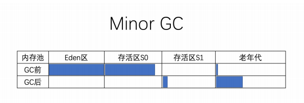
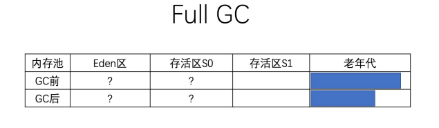
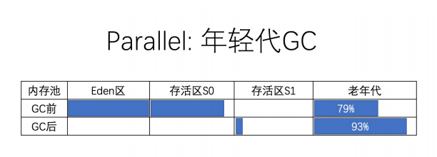
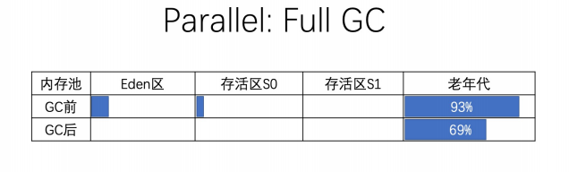

## 作业
### 1. 使用 GCLogAnalysis.java 自己演练一遍串行/并行/CMS/G1的案例。
1. 使用串行GC，内存128m

    ```shell script
    -Xms128m -Xmx128m -XX:+PrintGCDetails -XX:+PrintGCDateStamps -XX:+UseSerialGC
    ```
    ```
    开始执行
    2020-10-27T10:25:53.742+0800: [GC (Allocation Failure) 2020-10-27T10:25:53.742+0800: [DefNew: 34936K->4351K(39296K), 0.0066066 secs] 34936K->9053K(126720K), 0.0066741 secs] [Times: user=0.03 sys=0.00, real=0.01 secs]
    2020-10-27T10:25:53.766+0800: [GC (Allocation Failure) 2020-10-27T10:25:53.767+0800: [DefNew: 38130K->3649K(39296K), 0.0097523 secs] 42832K->21926K(126720K), 0.0105410 secs] [Times: user=0.01 sys=0.00, real=0.01 secs]
    2020-10-27T10:25:53.787+0800: [GC (Allocation Failure) 2020-10-27T10:25:53.787+0800: [DefNew: 37100K->4071K(39296K), 0.0050169 secs] 55377K->31181K(126720K), 0.0050579 secs] [Times: user=0.00 sys=0.00, real=0.01 secs]
    2020-10-27T10:25:53.805+0800: [GC (Allocation Failure) 2020-10-27T10:25:53.806+0800: [DefNew: 38980K->3122K(39296K), 0.0031718 secs] 66089K->35561K(126720K), 0.0032097 secs] [Times: user=0.01 sys=0.01, real=0.00 secs]
    2020-10-27T10:25:53.822+0800: [GC (Allocation Failure) 2020-10-27T10:25:53.822+0800: [DefNew: 35585K->2846K(39296K), 0.0077083 secs] 68024K->49201K(126720K), 0.0077478 secs] [Times: user=0.02 sys=0.02, real=0.01 secs]
    2020-10-27T10:25:53.853+0800: [GC (Allocation Failure) 2020-10-27T10:25:53.854+0800: [DefNew: 36051K->4247K(39296K), 0.0057776 secs] 82407K->60770K(126720K), 0.0058656 secs] [Times: user=0.01 sys=0.00, real=0.01 secs]
    2020-10-27T10:25:53.867+0800: [GC (Allocation Failure) 2020-10-27T10:25:53.867+0800: [DefNew: 33289K->3850K(39296K), 0.0054377 secs] 89813K->69835K(126720K), 0.0054772 secs] [Times: user=0.02 sys=0.00, real=0.00 secs]
    2020-10-27T10:25:53.876+0800: [GC (Allocation Failure) 2020-10-27T10:25:53.876+0800: [DefNew: 37304K->3928K(39296K), 0.0085025 secs] 103289K->87824K(126720K), 0.0085570 secs] [Times: user=0.00 sys=0.00, real=0.01 secs]
    2020-10-27T10:25:53.891+0800: [GC (Allocation Failure) 2020-10-27T10:25:53.891+0800: [DefNew: 36086K->36086K(39296K), 0.0000182 secs]2020-10-27T10:25:53.891+0800: [Tenured: 83895K->87221K(87424K), 0.0432612 secs] 119981K->100446K(126720K), [Metaspace: 3355K->3355K(1056768K)], 0.0433393 secs] [Times: user=0.02 sys=0.00, real=0.04 secs]
    2020-10-27T10:25:53.940+0800: [Full GC (Allocation Failure) 2020-10-27T10:25:53.940+0800: [Tenured: 87221K->87221K(87424K), 0.0037308 secs] 124449K->104570K(126720K), [Metaspace: 3355K->3355K(1056768K)], 0.0037758 secs] [Times: user=0.00 sys=0.00, real=0.00 secs]
    2020-10-27T10:25:53.949+0800: [Full GC (Allocation Failure) 2020-10-27T10:25:53.949+0800: [Tenured: 87221K->87221K(87424K), 0.0032922 secs] 125476K->115754K(126720K), [Metaspace: 3355K->3355K(1056768K)], 0.0033404 secs] [Times: user=0.00 sys=0.00, real=0.00 secs]
    2020-10-27T10:25:53.953+0800: [Full GC (Allocation Failure) 2020-10-27T10:25:53.953+0800: [Tenured: 87221K->84344K(87424K), 0.0191020 secs] 120411K->112321K(126720K), [Metaspace: 3355K->3355K(1056768K)], 0.0191435 secs] [Times: user=0.01 sys=0.00, real=0.02 secs]
    2020-10-27T10:25:53.975+0800: [Full GC (Allocation Failure) 2020-10-27T10:25:53.975+0800: [Tenured: 86072K->86072K(87424K), 0.0034572 secs] 125349K->115926K(126720K), [Metaspace: 3355K->3355K(1056768K)], 0.0035082 secs] [Times: user=0.00 sys=0.00, real=0.00 secs]
    2020-10-27T10:25:53.981+0800: [Full GC (Allocation Failure) 2020-10-27T10:25:53.982+0800: [Tenured: 86369K->86369K(87424K), 0.0044863 secs] 125336K->117893K(126720K), [Metaspace: 3355K->3355K(1056768K)], 0.0045436 secs] [Times: user=0.00 sys=0.00, real=0.01 secs]
    2020-10-27T10:25:53.986+0800: [Full GC (Allocation Failure) 2020-10-27T10:25:53.986+0800: [Tenured: 86369K->84618K(87424K), 0.0190756 secs] 117893K->116142K(126720K), [Metaspace: 3355K->3355K(1056768K)], 0.0191103 secs] [Times: user=0.01 sys=0.00, real=0.02 secs]
    Exception in thread "main" java.lang.OutOfMemoryError: Java heap space
    	at code.GCLogAnalysis.generateGarbage(GCLogAnalysis.java:52)
    	at code.GCLogAnalysis.main(GCLogAnalysis.java:30)
    Heap
     def new generation   total 39296K, used 32518K [0x00000000f8000000, 0x00000000faaa0000, 0x00000000faaa0000)
      eden space 34944K,  93% used [0x00000000f8000000, 0x00000000f9fc1990, 0x00000000fa220000)
      from space 4352K,   0% used [0x00000000fa220000, 0x00000000fa220000, 0x00000000fa660000)
      to   space 4352K,   0% used [0x00000000fa660000, 0x00000000fa660000, 0x00000000faaa0000)
     tenured generation   total 87424K, used 84618K [0x00000000faaa0000, 0x0000000100000000, 0x0000000100000000)
       the space 87424K,  96% used [0x00000000faaa0000, 0x00000000ffd42b78, 0x00000000ffd42c00, 0x0000000100000000)
     Metaspace       used 3386K, capacity 4556K, committed 4864K, reserved 1056768K
      class space    used 366K, capacity 392K, committed 512K, reserved 1048576K
    Disconnected from the target VM, address: '127.0.0.1:58863', transport: 'socket'
    ```
   #### GC log解读：

   young GC
    > 1. GC – 用来区分 Minor GC 还是 Full GC 的标志。 GC 表明这是一次小型GC(Minor GC)，即年轻代GC。 Allocation Failure 表示触发 GC 的原因。本次GC事件，是由于对象分配失败，年轻代中没有空间来存放新生成的对象引起的。
    > 2. DefNew – 表示垃圾收集器的名称。这个名字表示：年轻代使用的单线程、标记­复制、STW 垃圾收集器。 34936K->4351K 表示在垃圾收集之前和之后的年轻代使用量。 (39296K) 表示年轻代的总空间大小。进一步分析可知：GC之后年轻代使用率为11%。
    > 3. 34936K->9053K(126720K) – 表示在垃圾收集之前和之后整个堆内存的使用情况。 (126720K) 则表示堆内存可用的总空间大小。进一步分析可知: GC之后堆内存使用量为7%。
    > 4. 0.0066741 secs – GC事件持续的时间，以秒为单位。
    > 5. [Times: user=0.03 sys=0.00, real=0.01 secs] – 此次GC事件的持续时间，通过三个部分来衡量： user 部分表示所有 GC线程消耗的CPU时间； sys 部分表示系统调用和系统等待事件消耗的时间。 real 则表示应用程序暂停的时间。因为串行垃圾收集器(Serial Garbage Collector)只使用单个线程，所以这里 real = user + system ，0.01秒也就是10毫秒

    在此次垃圾收集之前，堆内存总的使用量为 34936K ，其中年轻代使用了 34936K 。可以算出，GC之前老年代空间的使用量为 0 。【实际上这是GC日志中的第一条记录】
    GC前后对比，年轻代的使用量为 34936K->4351K ，减少了 30584k 。但堆内存的总使用量 34936K->9053K 只下降了 25883k 。
    可以算出，从年轻代提升到老年代的对象占用了 30584k ‐ 25883k = 4701k 的内存空间。当然，另一组数字也能推算出GC之后老年代的使用量 9053k ‐ 4351k= 470.

    此次GC的示意图如下：

    

    #### full GC
    >1.  [DefNew: 36086K->36086K(39296K), 0.0000182 secs] – 前面已经解读过了，因为内存分配失败，发生了一次年轻代 GC。此次GC同样用的DefNew 收集器。注意：此次垃圾收集消耗了 0.0000182 秒，基本上确认本次GC事件没怎么处理年轻代。
    >2. Tenured – 用于清理老年代空间的垃圾收集器名称。 Tenured 表明使用的是单线程的STW垃圾收集器，使用的算法为 标记‐清除‐整理(mark‐sweep‐compact )
    >3. 83895K->87221K(87424K) 表示GC前后老年代的使用量，以及老年代的空间大小。 0.0432612 secs 是清理老年代所花的时间。
    >4. 119981K->100446K(126720K) 在GC前后整个堆内存部分的使用情况，以及可用的堆空间大小。
    >5. [Metaspace: 3355K->3355K(1056768K)] – Metaspace 空间的变化情况。可以看出，此次GC过程中 Metaspace 也没有什么变化。
    >6. [Times: user=0.02 sys=0.00, real=0.04 secs] 40毫秒的暂停时间，比起前面年轻代的GC来说增加了4倍左右。这个时间跟什么有关系呢? 答案是: GC时间，与GC后存活对象的总数量关系最大

    进一步分析这些数据，GC之后老年代的使用率为： 83895K / 87221K = 96% ，这个比例不算小，说明old区gc后并没有下降很多，可能有问题了

    和年轻代GC 相比，比较明显的差别是此次GC事件清理了老年代和Metaspace

    此次GC的示意图如下：

    
    ### 整体分析：
    1. 发现经过几次young（Minor） GC后,每次young gc都会将一部分的年轻代的对象移到old区
    2. 等old区即将满了的时候，发生了一次full gc，本次young区并没有将对象移到old区，old区进行了一次gc，但是内存并没有下降很多
    3. 经过几次full gc后（注意：每次gcold区回收的都不多，说明old内存可能不够）
    4. 最后，old区实在满了，再也回收不了了，就发生了OOM，原因是old 区放不下了

    ### 串行将内存提升至1g
    ```
       开始执行
       2020-10-27T11:11:06.837+0800: [GC (Allocation Failure) 2020-10-27T11:11:06.837+0800: [DefNew: 277784K->34944K(314560K), 0.0518967 secs] 277784K->123604K(1013632K), 0.0519552 secs] [Times: user=0.02 sys=0.05, real=0.05 secs]
       2020-10-27T11:11:06.938+0800: [GC (Allocation Failure) 2020-10-27T11:11:06.938+0800: [DefNew: 314220K->34933K(314560K), 0.0586569 secs] 402880K->231599K(1013632K), 0.0586951 secs] [Times: user=0.03 sys=0.03, real=0.06 secs]
       2020-10-27T11:11:07.032+0800: [GC (Allocation Failure) 2020-10-27T11:11:07.033+0800: [DefNew: 313182K->34841K(314560K), 0.0475975 secs] 509849K->337496K(1013632K), 0.0476382 secs] [Times: user=0.01 sys=0.03, real=0.05 secs]
       2020-10-27T11:11:07.126+0800: [GC (Allocation Failure) 2020-10-27T11:11:07.126+0800: [DefNew: 314457K->34901K(314560K), 0.0452156 secs] 617112K->433616K(1013632K), 0.0452543 secs] [Times: user=0.03 sys=0.01, real=0.05 secs]
       2020-10-27T11:11:07.205+0800: [GC (Allocation Failure) 2020-10-27T11:11:07.205+0800: [DefNew: 311849K->34894K(314560K), 0.0569160 secs] 710564K->569894K(1013632K), 0.0569574 secs] [Times: user=0.01 sys=0.05, real=0.06 secs]
       2020-10-27T11:11:07.309+0800: [GC (Allocation Failure) 2020-10-27T11:11:07.309+0800: [DefNew: 310653K->34932K(314560K), 0.0377800 secs] 845653K->652059K(1013632K), 0.0378215 secs] [Times: user=0.00 sys=0.03, real=0.04 secs]
       2020-10-27T11:11:07.391+0800: [GC (Allocation Failure) 2020-10-27T11:11:07.391+0800: [DefNew: 313778K->313778K(314560K), 0.0000189 secs]2020-10-27T11:11:07.391+0800: [Tenured: 617126K->697967K(699072K), 0.0771928 secs] 930904K->729226K(1013632K), [Metaspace: 3529K->3529K(1056768K)], 0.0772765 secs] [Times: user=0.03 sys=0.05, real=0.08 secs]
       2020-10-27T11:11:07.511+0800: [Full GC (Allocation Failure) 2020-10-27T11:11:07.511+0800: [Tenured: 697967K->697546K(699072K), 0.0993036 secs] 1007078K->800684K(1013632K), [Metaspace: 3529K->3529K(1056768K)], 0.0993498 secs] [Times: user=0.09 sys=0.00, real=0.10 secs]
       2020-10-27T11:11:07.656+0800: [Full GC (Allocation Failure) 2020-10-27T11:11:07.656+0800: [Tenured: 697546K->698352K(699072K), 0.1167804 secs] 1008407K->837464K(1013632K), [Metaspace: 3547K->3547K(1056768K)], 0.1168357 secs] [Times: user=0.11 sys=0.00, real=0.12 secs]
       执行结束，共生成对象次数：891
       Heap
        def new generation   total 314560K, used 156465K [0x00000000c0000000, 0x00000000d5550000, 0x00000000d5550000)
         eden space 279616K,  55% used [0x00000000c0000000, 0x00000000c98cc7d8, 0x00000000d1110000)
         from space 34944K,   0% used [0x00000000d1110000, 0x00000000d1110000, 0x00000000d3330000)
         to   space 34944K,   0% used [0x00000000d3330000, 0x00000000d3330000, 0x00000000d5550000)
        tenured generation   total 699072K, used 698352K [0x00000000d5550000, 0x0000000100000000, 0x0000000100000000)
          the space 699072K,  99% used [0x00000000d5550000, 0x00000000fff4c3d0, 0x00000000fff4c400, 0x0000000100000000)
        Metaspace       used 4024K, capacity 4572K, committed 4864K, reserved 1056768K
         class space    used 449K, capacity 460K, committed 512K, reserved 1048576K
    ```

    发现，young gc和full gc次数都少了，虽然没有oom，但是old区也用了99%了，内存再少点估计还会oom

2. 使用并行GC，内存128m
    > 并行垃圾收集器对年轻代使用 标记‐复制(mark‐copy) 算法，对老年代使用 标记‐
      清除‐整理(mark‐sweep‐compact) 算法。年轻代和老年代的垃圾回收时都会触发
      STW事件，暂停所有的应用线程，再来执行垃圾收集。在执行 标记 和 复制/整理
      二、Parallel GC 日志解读
      阶段时都使用多个线程，因此得名“ Parallel ”。通过多个GC线程并行执行的方式，
      能使JVM在多CPU平台上的GC时间大幅减少。
    ```
       -Xms128m -Xmx128m -XX:+PrintGCDetails -XX:+PrintGCDateStamps ‐XX:+UseParallelGC
    ```
   并行垃圾收集器适用于多核服务器，其主要目标是增加系统吞吐量(也就是降低GC总体消耗的时间)。为了达成这个目标，会尽量使用尽可能多的CPU资源：
    - 在GC事件执行期间，所有 CPU 内核都在并行地清理垃圾，所以暂停时间相对来说更短
    - 在两次GC事件中间的间隔期，不会启动GC线程，所以这段时间内不会消耗任何系统资源

   另一方面，因为并行GC的所有阶段都不能中断，所以并行GC很可能会出现长时间的卡顿。长时间卡顿的意思，就是并行GC启动后，一次性完成所有的GC操作，所以单次暂停的时间较长。假如系统延迟是非常重要的性能指标，那么就应该选择其他垃圾收集器。

    ```
       2020-10-27T11:20:56.512+0800: [GC (Allocation Failure) [PSYoungGen: 31796K->4906K(38400K)] 31796K->11913K(125952K), 0.0078149 secs] [Times: user=0.00 sys=0.00, real=0.01 secs]
       2020-10-27T11:20:56.528+0800: [GC (Allocation Failure) [PSYoungGen: 31397K->5115K(38400K)] 38404K->27205K(125952K), 0.0060942 secs] [Times: user=0.00 sys=0.00, real=0.01 secs]
       2020-10-27T11:20:56.542+0800: [GC (Allocation Failure) [PSYoungGen: 33971K->5011K(38400K)] 56061K->41481K(125952K), 0.0067273 secs] [Times: user=0.00 sys=0.00, real=0.01 secs]
       2020-10-27T11:20:56.558+0800: [GC (Allocation Failure) [PSYoungGen: 37933K->5043K(38400K)] 74403K->55690K(125952K), 0.0112441 secs] [Times: user=0.05 sys=0.00, real=0.01 secs]
       2020-10-27T11:20:56.579+0800: [GC (Allocation Failure) [PSYoungGen: 37178K->4467K(37888K)] 87825K->65343K(125440K), 0.0074521 secs] [Times: user=0.03 sys=0.00, real=0.01 secs]
       2020-10-27T11:20:56.596+0800: [GC (Allocation Failure) [PSYoungGen: 36893K->4914K(20480K)] 97769K->78195K(108032K), 0.0095557 secs] [Times: user=0.02 sys=0.01, real=0.01 secs]
       2020-10-27T11:20:56.606+0800: [Full GC (Ergonomics) [PSYoungGen: 4914K->0K(20480K)] [ParOldGen: 73281K->78129K(87552K)] 78195K->78129K(108032K), [Metaspace: 3524K->3524K(1056768K)], 0.0215017 secs] [Times: user=0.03 sys=0.00, real=0.02 secs]
       2020-10-27T11:20:56.633+0800: [Full GC (Ergonomics) [PSYoungGen: 13720K->0K(20480K)] [ParOldGen: 78129K->82048K(87552K)] 91849K->82048K(108032K), [Metaspace: 3524K->3524K(1056768K)], 0.0218380 secs] [Times: user=0.05 sys=0.00, real=0.02 secs]
       2020-10-27T11:20:56.657+0800: [Full GC (Ergonomics) [PSYoungGen: 13669K->0K(20480K)] [ParOldGen: 82048K->85584K(87552K)] 95717K->85584K(108032K), [Metaspace: 3524K->3524K(1056768K)], 0.0036542 secs] [Times: user=0.00 sys=0.00, real=0.00 secs]
       2020-10-27T11:20:56.664+0800: [Full GC (Ergonomics) [PSYoungGen: 14535K->4295K(20480K)] [ParOldGen: 85584K->85584K(87552K)] 100120K->89879K(108032K), [Metaspace: 3524K->3524K(1056768K)], 0.0035670 secs] [Times: user=0.00 sys=0.00, real=0.00 secs]
       2020-10-27T11:20:56.668+0800: [Full GC (Ergonomics) [PSYoungGen: 14458K->10085K(20480K)] [ParOldGen: 85584K->85584K(87552K)] 100043K->95669K(108032K), [Metaspace: 3524K->3524K(1056768K)], 0.0048546 secs] [Times: user=0.00 sys=0.00, real=0.01 secs]
       2020-10-27T11:20:56.673+0800: [Full GC (Ergonomics) [PSYoungGen: 14848K->10085K(20480K)] [ParOldGen: 85584K->85584K(87552K)] 100432K->95669K(108032K), [Metaspace: 3524K->3524K(1056768K)], 0.0226031 secs] [Times: user=0.06 sys=0.00, real=0.02 secs]
       2020-10-27T11:20:56.696+0800: [Full GC (Allocation Failure) [PSYoungGen: 10085K->10085K(20480K)] [ParOldGen: 85584K->85559K(87552K)] 95669K->95644K(108032K), [Metaspace: 3524K->3524K(1056768K)], 0.0272828 secs] [Times: user=0.06 sys=0.00, real=0.03 secs]
       Exception in thread "main" java.lang.OutOfMemoryError: Java heap space
       	at code.GCLogAnalysis.generateGarbage(GCLogAnalysis.java:52)
       	at code.GCLogAnalysis.main(GCLogAnalysis.java:30)
       Heap
        PSYoungGen      total 20480K, used 10579K [0x00000000fd580000, 0x0000000100000000, 0x0000000100000000)
         eden space 14848K, 71% used [0x00000000fd580000,0x00000000fdfd4d78,0x00000000fe400000)
         from space 5632K, 0% used [0x00000000ffa80000,0x00000000ffa80000,0x0000000100000000)
         to   space 14336K, 0% used [0x00000000fe400000,0x00000000fe400000,0x00000000ff200000)
        ParOldGen       total 87552K, used 85559K [0x00000000f8000000, 0x00000000fd580000, 0x00000000fd580000)
         object space 87552K, 97% used [0x00000000f8000000,0x00000000fd38dc28,0x00000000fd580000)
        Metaspace       used 3555K, capacity 4508K, committed 4864K, reserved 1056768K
         class space    used 394K, capacity 396K, committed 512K, reserved 1048576K
    ```
    #### GC log解读：
    #### young GC

    >1. PSYoungGen – 垃圾收集器的名称。这个名字表示的是在年轻代中使用的：并行的 标记‐复制(mark‐copy) ，全线暂停(STW) 垃圾收集器。 31796K->4906K(38400K) 表示GC前后的年轻代使用量，以及年轻代的总大小，简单计算GC后的年轻代使用率 4906K / 38400K = 12% 。
    >2. 31796K->11913K(125952K) 则是GC前后整个堆内存的使用量，以及此时可用堆的总大小，GC后堆内存使用率为 341556K / 466432K = 9%
    >3. [Times: user=0.00 sys=0.00, real=0.01 secs] – GC事件的持续时
       间，通过三个部分来衡量： user 表示GC线程所消耗的总CPU时间， sys 表示
       操作系统调用和系统等待事件所消耗的时间； real 则表示应用程序实际暂停的
       时间。因为并不是所有的操作过程都能全部并行，所以在 Parallel GC 中， real
       约等于 user + system /GC线程数 。 本地机器是4个物理线程，所以默认是4
       个GC线程。

    总结：年轻代GC，我们可以关注暂停时间，以及GC后的内存使用率是否正常，
    但不用特别关注GC前的使用量，而且只要业务在运行，年轻代的对象分配就少不
    了，回收量也就不会少。

    此次GC的内存变化示意图为:

    

    #### full gc
    >1. [PSYoungGen: 4914K->0K(20480K)] – 和上面的示例一样，清理年轻代的垃圾收集器是名为 “PSYoungGen” 的STW收集器，采用 标记‐复制(mark‐copy) 算法。年轻代使用量从 4914K 变为 0 ，一般 Full GC 中年轻代的结果都是这样。
    >2. ParOldGen – 用于清理老年代空间的垃圾收集器类型。在这里使用的是名为ParOldGen 的垃圾收集器，这是一款并行 STW垃圾收集器，算法为 标记‐清除‐整理(mark‐sweep‐compact) 。
    >3. Metaspace: 3524K->3524K(1056768K)– 前面我们也看到了关于Metaspace 空间的类似信息。可以看出，在GC事件中 Metaspace 里面没有回收任何对象。

    Full GC 和 Minor GC 的区别是很明显的 —— 此次GC事件除了处理年轻代，还清理了
    老年代和 Metaspace

    总结: Full GC时我们更关注老年代的使用量有没有下降，以及下降了多少。如果FullGC之后内存不怎么下降，使用率还很高，那就说明系统有问题了。

    此次GC的内存变化示意图为：

    

    ### 并行 GC log整体分析：
    1. 发现经过几次young（Minor） GC后,每次young gc都会将一部分的年轻代的对象移到old区
    2. 等old区即将满了，young区的对象移到old区会溢出的时候，发生了一次full gc，本次young区对象全部回收了，但是old区gc后，反而变大了，我理解是年轻代转移到old区的大于old区自己回收的，所以整体上表现old变大了
    3. 经过几次full gc后，old区回收达到上限，就OOM了

   ```
       Allocation Failure： 在young gc时，表示向young 区申请空间，结果不够导致的gc。在MajorGC时，Allocation Failure 就是new区对象晋升到old区分配失败了，触发GC。
       Ergonomics: Ergonomics是通过统计值类似于启发式的分析估计到我即将要Allocation Failure了。所以综上，Ergonomics触发是为了避免Allocation Failure，并且在old区发生Allocation Failure之前会遇到多次的Ergonomics
    ```
    ### 并行GC将内存提升至512m
    ```
    开始执行
    2020-10-27T17:58:08.846+0800: [GC (Allocation Failure) [PSYoungGen: 202695K->33637K(239104K)] 202695K->65796K(785408K), 0.0382198 secs] [Times: user=0.06 sys=0.02, real=0.04 secs]
    2020-10-27T17:58:08.926+0800: [GC (Allocation Failure) [PSYoungGen: 238423K->33787K(239104K)] 270582K->139500K(785408K), 0.0375748 secs] [Times: user=0.05 sys=0.05, real=0.04 secs]
    2020-10-27T17:58:08.998+0800: [GC (Allocation Failure) [PSYoungGen: 237622K->33778K(239104K)] 343335K->198619K(785408K), 0.0338270 secs] [Times: user=0.02 sys=0.05, real=0.03 secs]
    2020-10-27T17:58:09.073+0800: [GC (Allocation Failure) [PSYoungGen: 236503K->33787K(239104K)] 401344K->265291K(785408K), 0.0259999 secs] [Times: user=0.03 sys=0.05, real=0.03 secs]
    2020-10-27T17:58:09.138+0800: [GC (Allocation Failure) [PSYoungGen: 237215K->33789K(239104K)] 468719K->326775K(785408K), 0.0254216 secs] [Times: user=0.00 sys=0.05, real=0.03 secs]
    2020-10-27T17:58:09.214+0800: [GC (Allocation Failure) [PSYoungGen: 239101K->33785K(125440K)] 532087K->400164K(671744K), 0.0369207 secs] [Times: user=0.08 sys=0.06, real=0.04 secs]
    2020-10-27T17:58:09.270+0800: [GC (Allocation Failure) [PSYoungGen: 125433K->40124K(182272K)] 491812K->419000K(728576K), 0.0128618 secs] [Times: user=0.00 sys=0.03, real=0.01 secs]
    2020-10-27T17:58:09.300+0800: [GC (Allocation Failure) [PSYoungGen: 131582K->65404K(182272K)] 510458K->448146K(728576K), 0.0112682 secs] [Times: user=0.06 sys=0.00, real=0.01 secs]
    2020-10-27T17:58:09.325+0800: [GC (Allocation Failure) [PSYoungGen: 157042K->87685K(182272K)] 539784K->493621K(728576K), 0.0259482 secs] [Times: user=0.03 sys=0.00, real=0.03 secs]
    2020-10-27T17:58:09.363+0800: [GC (Allocation Failure) [PSYoungGen: 178644K->59019K(182272K)] 584581K->514017K(728576K), 0.0219647 secs] [Times: user=0.03 sys=0.03, real=0.02 secs]
    2020-10-27T17:58:09.386+0800: [Full GC (Ergonomics) [PSYoungGen: 59019K->0K(182272K)] [ParOldGen: 454997K->499372K(546304K)] 514017K->499372K(728576K), [Metaspace: 3529K->3529K(1056768K)], 0.0889958 secs] [Times: user=0.22 sys=0.01, real=0.09 secs]
    2020-10-27T17:58:09.487+0800: [Full GC (Ergonomics) [PSYoungGen: 91431K->0K(182272K)] [ParOldGen: 499372K->521999K(546304K)] 590803K->521999K(728576K), [Metaspace: 3529K->3529K(1056768K)], 0.1159948 secs] [Times: user=0.23 sys=0.02, real=0.12 secs]
    2020-10-27T17:58:09.622+0800: [Full GC (Ergonomics) [PSYoungGen: 90885K->12892K(182272K)] [ParOldGen: 521999K->545913K(546304K)] 612885K->558806K(728576K), [Metaspace: 3833K->3833K(1056768K)], 0.1316321 secs] [Times: user=0.31 sys=0.00, real=0.13 secs]
    执行结束，共生成对象次数：646
    Heap
     PSYoungGen      total 182272K, used 18343K [0x00000000ef580000, 0x0000000100000000, 0x0000000100000000)
      eden space 91648K, 20% used [0x00000000ef580000,0x00000000f0769e98,0x00000000f4f00000)
      from space 90624K, 0% used [0x00000000fa780000,0x00000000fa780000,0x0000000100000000)
      to   space 90624K, 0% used [0x00000000f4f00000,0x00000000f4f00000,0x00000000fa780000)
     ParOldGen       total 546304K, used 545913K [0x00000000ce000000, 0x00000000ef580000, 0x00000000ef580000)
      object space 546304K, 99% used [0x00000000ce000000,0x00000000ef51e750,0x00000000ef580000)
     Metaspace       used 3845K, capacity 4572K, committed 4864K, reserved 1056768K
      class space    used 433K, capacity 460K, committed 512K, reserved 1048576K
   ```
    ### 并行GC将内存提升至1g
    ```
       开始执行
       2020-10-27T17:51:01.458+0800: [GC (Allocation Failure) [PSYoungGen: 260178K->43511K(305664K)] 260178K->61430K(1005056K), 0.0285397 secs] [Times: user=0.00 sys=0.01, real=0.03 secs]
       2020-10-27T17:51:01.553+0800: [GC (Allocation Failure) [PSYoungGen: 305655K->43480K(305664K)] 323574K->144857K(1005056K), 0.0530767 secs] [Times: user=0.08 sys=0.03, real=0.05 secs]
       2020-10-27T17:51:01.650+0800: [GC (Allocation Failure) [PSYoungGen: 305624K->43496K(305664K)] 407001K->231768K(1005056K), 0.0405966 secs] [Times: user=0.03 sys=0.05, real=0.04 secs]
       2020-10-27T17:51:01.733+0800: [GC (Allocation Failure) [PSYoungGen: 305577K->43471K(305664K)] 493849K->331683K(1005056K), 0.0509853 secs] [Times: user=0.01 sys=0.06, real=0.05 secs]
       2020-10-27T17:51:01.825+0800: [GC (Allocation Failure) [PSYoungGen: 304861K->43489K(305664K)] 593072K->413684K(1005056K), 0.0314218 secs] [Times: user=0.02 sys=0.08, real=0.03 secs]
       2020-10-27T17:51:01.893+0800: [GC (Allocation Failure) [PSYoungGen: 305556K->43505K(305664K)] 675751K->539257K(1005056K), 0.1168404 secs] [Times: user=0.13 sys=0.26, real=0.12 secs]
       2020-10-27T17:51:02.052+0800: [GC (Allocation Failure) [PSYoungGen: 302112K->43514K(305664K)] 797864K->631803K(1005056K), 0.0727660 secs] [Times: user=0.06 sys=0.22, real=0.07 secs]
       2020-10-27T17:51:02.125+0800: [Full GC (Ergonomics) [PSYoungGen: 43514K->0K(305664K)] [ParOldGen: 588288K->575863K(699392K)] 631803K->575863K(1005056K), [Metaspace: 3531K->3531K(1056768K)], 0.1041365 secs] [Times: user=0.36 sys=0.00, real=0.10 secs]
       2020-10-27T17:51:02.271+0800: [Full GC (Ergonomics) [PSYoungGen: 255009K->0K(305664K)] [ParOldGen: 575863K->641303K(699392K)] 830873K->641303K(1005056K), [Metaspace: 3961K->3961K(1056768K)], 0.1134471 secs] [Times: user=0.27 sys=0.09, real=0.11 secs]
       执行结束，共生成对象次数：807
       Heap
        PSYoungGen      total 305664K, used 17928K [0x00000000eab00000, 0x0000000100000000, 0x0000000100000000)
         eden space 262144K, 6% used [0x00000000eab00000,0x00000000ebc82318,0x00000000fab00000)
         from space 43520K, 0% used [0x00000000fab00000,0x00000000fab00000,0x00000000fd580000)
         to   space 43520K, 0% used [0x00000000fd580000,0x00000000fd580000,0x0000000100000000)
        ParOldGen       total 699392K, used 641303K [0x00000000c0000000, 0x00000000eab00000, 0x00000000eab00000)
         object space 699392K, 91% used [0x00000000c0000000,0x00000000e7245e20,0x00000000eab00000)
        Metaspace       used 4024K, capacity 4572K, committed 4864K, reserved 1056768K
         class space    used 449K, capacity 460K, committed 512K, reserved 1048576K
    ```
   只发生两次full gc

3. 使用并行GC，内存128m
    ```
    开始执行
    2020-10-27T18:02:37.794+0800: [GC (Allocation Failure) 2020-10-27T18:02:37.794+0800: [ParNew: 33859K->3941K(39296K), 0.0054393 secs] 33859K->16219K(126720K), 0.0055107 secs] [Times: user=0.00 sys=0.00, real=0.01 secs]
    2020-10-27T18:02:37.808+0800: [GC (Allocation Failure) 2020-10-27T18:02:37.808+0800: [ParNew: 38840K->3908K(39296K), 0.0075322 secs] 51119K->31362K(126720K), 0.0075745 secs] [Times: user=0.00 sys=0.00, real=0.01 secs]
    2020-10-27T18:02:37.827+0800: [GC (Allocation Failure) 2020-10-27T18:02:37.827+0800: [ParNew: 36509K->4184K(39296K), 0.0050299 secs] 63963K->41052K(126720K), 0.0050718 secs] [Times: user=0.00 sys=0.00, real=0.01 secs]
    2020-10-27T18:02:37.842+0800: [GC (Allocation Failure) 2020-10-27T18:02:37.842+0800: [ParNew: 38564K->4245K(39296K), 0.0121204 secs] 75432K->65750K(126720K), 0.0121635 secs] [Times: user=0.03 sys=0.02, real=0.01 secs]
    2020-10-27T18:02:37.854+0800: [GC (CMS Initial Mark) [1 CMS-initial-mark: 61505K(87424K)] 67597K(126720K), 0.0002065 secs] [Times: user=0.00 sys=0.00, real=0.00 secs]
    2020-10-27T18:02:37.855+0800: [CMS-concurrent-mark-start]
    2020-10-27T18:02:37.857+0800: [CMS-concurrent-mark: 0.002/0.002 secs] [Times: user=0.00 sys=0.00, real=0.00 secs]
    2020-10-27T18:02:37.857+0800: [CMS-concurrent-preclean-start]
    2020-10-27T18:02:37.857+0800: [CMS-concurrent-preclean: 0.000/0.000 secs] [Times: user=0.00 sys=0.00, real=0.00 secs]
    2020-10-27T18:02:37.857+0800: [CMS-concurrent-abortable-preclean-start]
    2020-10-27T18:02:37.863+0800: [GC (Allocation Failure) 2020-10-27T18:02:37.863+0800: [ParNew: 38439K->38439K(39296K), 0.0000213 secs]2020-10-27T18:02:37.863+0800: [CMS2020-10-27T18:02:37.863+0800: [CMS-concurrent-abortable-preclean: 0.000/0.006 secs] [Times: user=0.00 sys=0.00, real=0.01 secs]
     (concurrent mode failure): 61505K->76035K(87424K), 0.0194387 secs] 99944K->76035K(126720K), [Metaspace: 3522K->3522K(1056768K)], 0.0195264 secs] [Times: user=0.05 sys=0.00, real=0.02 secs]
    2020-10-27T18:02:37.889+0800: [GC (Allocation Failure) 2020-10-27T18:02:37.889+0800: [ParNew: 30378K->30378K(39296K), 0.0000237 secs]2020-10-27T18:02:37.889+0800: [CMS: 76035K->85727K(87424K), 0.0165677 secs] 106413K->88358K(126720K), [Metaspace: 3522K->3522K(1056768K)], 0.0166514 secs] [Times: user=0.01 sys=0.00, real=0.02 secs]
    2020-10-27T18:02:37.914+0800: [GC (CMS Initial Mark) [1 CMS-initial-mark: 85727K(87424K)] 117627K(126720K), 0.0017657 secs] [Times: user=0.00 sys=0.00, real=0.00 secs]
    2020-10-27T18:02:37.916+0800: [CMS-concurrent-mark-start]
    2020-10-27T18:02:37.917+0800: [CMS-concurrent-mark: 0.001/0.001 secs] [Times: user=0.00 sys=0.00, real=0.00 secs]
    2020-10-27T18:02:37.917+0800: [CMS-concurrent-preclean-start]
    2020-10-27T18:02:37.918+0800: [CMS-concurrent-preclean: 0.001/0.001 secs] [Times: user=0.00 sys=0.00, real=0.00 secs]
    2020-10-27T18:02:37.918+0800: [CMS-concurrent-abortable-preclean-start]
    2020-10-27T18:02:37.918+0800: [CMS-concurrent-abortable-preclean: 0.000/0.000 secs] [Times: user=0.00 sys=0.00, real=0.00 secs]
    2020-10-27T18:02:37.919+0800: [GC (CMS Final Remark) [YG occupancy: 38139 K (39296 K)]2020-10-27T18:02:37.919+0800: [Rescan (parallel) , 0.0005637 secs]2020-10-27T18:02:37.919+0800: [weak refs processing, 0.0000130 secs]2020-10-27T18:02:37.919+0800: [class unloading, 0.0003580 secs]2020-10-27T18:02:37.920+0800: [scrub symbol table, 0.0007315 secs]2020-10-27T18:02:37.920+0800: [scrub string table, 0.0001863 secs][1 CMS-remark: 85727K(87424K)] 123866K(126720K), 0.0019438 secs] [Times: user=0.00 sys=0.00, real=0.00 secs]
    2020-10-27T18:02:37.921+0800: [CMS-concurrent-sweep-start]
    2020-10-27T18:02:37.921+0800: [CMS-concurrent-sweep: 0.000/0.000 secs] [Times: user=0.00 sys=0.00, real=0.00 secs]
    2020-10-27T18:02:37.921+0800: [CMS-concurrent-reset-start]
    2020-10-27T18:02:37.921+0800: [CMS-concurrent-reset: 0.000/0.000 secs] [Times: user=0.00 sys=0.00, real=0.00 secs]
    2020-10-27T18:02:37.921+0800: [GC (Allocation Failure) 2020-10-27T18:02:37.921+0800: [ParNew: 38715K->38715K(39296K), 0.0000186 secs]2020-10-27T18:02:37.921+0800: [CMS: 85727K->85727K(87424K), 0.0054184 secs] 124442K->103190K(126720K), [Metaspace: 3522K->3522K(1056768K)], 0.0054831 secs] [Times: user=0.03 sys=0.00, real=0.01 secs]
    2020-10-27T18:02:37.934+0800: [Full GC (Allocation Failure) 2020-10-27T18:02:37.934+0800: [CMS: 85727K->85727K(87424K), 0.0052711 secs] 117023K->105362K(126720K), [Metaspace: 3522K->3522K(1056768K)], 0.0053232 secs] [Times: user=0.00 sys=0.00, real=0.00 secs]
    2020-10-27T18:02:37.940+0800: [GC (CMS Initial Mark) [1 CMS-initial-mark: 85727K(87424K)] 110909K(126720K), 0.0001279 secs] [Times: user=0.00 sys=0.00, real=0.00 secs]
    2020-10-27T18:02:37.940+0800: [CMS-concurrent-mark-start]
    2020-10-27T18:02:37.941+0800: [Full GC (Allocation Failure) 2020-10-27T18:02:37.941+0800: [CMS2020-10-27T18:02:37.941+0800: [CMS-concurrent-mark: 0.001/0.001 secs] [Times: user=0.00 sys=0.00, real=0.00 secs]
     (concurrent mode failure): 85727K->85727K(87424K), 0.0047990 secs] 116247K->109995K(126720K), [Metaspace: 3522K->3522K(1056768K)], 0.0048432 secs] [Times: user=0.01 sys=0.00, real=0.00 secs]
    2020-10-27T18:02:37.947+0800: [Full GC (Allocation Failure) 2020-10-27T18:02:37.947+0800: [CMS: 85727K->85727K(87424K), 0.0036301 secs] 123883K->116924K(126720K), [Metaspace: 3522K->3522K(1056768K)], 0.0036732 secs] [Times: user=0.00 sys=0.00, real=0.00 secs]
    2020-10-27T18:02:37.951+0800: [GC (CMS Initial Mark) [1 CMS-initial-mark: 85727K(87424K)] 119283K(126720K), 0.0001374 secs] [Times: user=0.00 sys=0.00, real=0.00 secs]
    2020-10-27T18:02:37.951+0800: [CMS-concurrent-mark-start]
    2020-10-27T18:02:37.953+0800: [CMS-concurrent-mark: 0.002/0.002 secs] [Times: user=0.00 sys=0.00, real=0.00 secs]
    2020-10-27T18:02:37.953+0800: [CMS-concurrent-preclean-start]
    2020-10-27T18:02:37.954+0800: [CMS-concurrent-preclean: 0.001/0.001 secs] [Times: user=0.00 sys=0.00, real=0.00 secs]
    2020-10-27T18:02:37.954+0800: [CMS-concurrent-abortable-preclean-start]
    2020-10-27T18:02:37.954+0800: [CMS-concurrent-abortable-preclean: 0.000/0.000 secs] [Times: user=0.00 sys=0.00, real=0.00 secs]
    2020-10-27T18:02:37.954+0800: [Full GC (Allocation Failure) 2020-10-27T18:02:37.954+0800: [CMS (concurrent mode failure): 87190K->87190K(87424K), 0.0038121 secs] 125967K->121035K(126720K), [Metaspace: 3522K->3522K(1056768K)], 0.0038551 secs] [Times: user=0.00 sys=0.00, real=0.00 secs]
    2020-10-27T18:02:37.959+0800: [Full GC (Allocation Failure) 2020-10-27T18:02:37.959+0800: [CMS: 87190K->87190K(87424K), 0.0039503 secs] 126113K->121886K(126720K), [Metaspace: 3522K->3522K(1056768K)], 0.0040367 secs] [Times: user=0.00 sys=0.00, real=0.00 secs]
    2020-10-27T18:02:37.969+0800: [Full GC (Allocation Failure) 2020-10-27T18:02:37.969+0800: [CMS: 87190K->87190K(87424K), 0.0041516 secs] 125608K->123038K(126720K), [Metaspace: 3522K->3522K(1056768K)], 0.0042116 secs] [Times: user=0.00 sys=0.00, real=0.00 secs]
    2020-10-27T18:02:37.976+0800: [Full GC (Allocation Failure) 2020-10-27T18:02:37.976+0800: [CMS: 87190K->87190K(87424K), 0.0042609 secs] 125528K->124190K(126720K), [Metaspace: 3522K->3522K(1056768K)], 0.0043146 secs] [Times: user=0.00 sys=0.00, real=0.00 secs]
    2020-10-27T18:02:37.981+0800: [Full GC (Allocation Failure) 2020-10-27T18:02:37.981+0800: [CMS: 87190K->87190K(87424K), 0.0052080 secs] 126281K->122030K(126720K), [Metaspace: 3522K->3522K(1056768K)], 0.0052636 secs] [Times: user=0.00 sys=0.00, real=0.01 secs]
    2020-10-27T18:02:37.987+0800: [GC (CMS Initial Mark) [1 CMS-initial-mark: 87190K(87424K)] 122318K(126720K), 0.0002933 secs] [Times: user=0.00 sys=0.00, real=0.00 secs]
    2020-10-27T18:02:37.987+0800: [CMS-concurrent-mark-start]
    2020-10-27T18:02:37.989+0800: [CMS-concurrent-mark: 0.001/0.001 secs] [Times: user=0.00 sys=0.00, real=0.00 secs]
    2020-10-27T18:02:37.989+0800: [CMS-concurrent-preclean-start]
    2020-10-27T18:02:37.990+0800: [CMS-concurrent-preclean: 0.001/0.001 secs] [Times: user=0.03 sys=0.00, real=0.00 secs]
    2020-10-27T18:02:37.990+0800: [CMS-concurrent-abortable-preclean-start]
    2020-10-27T18:02:37.990+0800: [CMS-concurrent-abortable-preclean: 0.000/0.000 secs] [Times: user=0.00 sys=0.00, real=0.00 secs]
    2020-10-27T18:02:37.990+0800: [GC (CMS Final Remark) [YG occupancy: 37720 K (39296 K)]2020-10-27T18:02:37.990+0800: [Rescan (parallel) , 0.0003422 secs]2020-10-27T18:02:37.991+0800: [weak refs processing, 0.0000118 secs]2020-10-27T18:02:37.991+0800: [class unloading, 0.0003221 secs]2020-10-27T18:02:37.991+0800: [scrub symbol table, 0.0007220 secs]2020-10-27T18:02:37.992+0800: [scrub string table, 0.0001772 secs][1 CMS-remark: 87190K(87424K)] 124911K(126720K), 0.0016674 secs] [Times: user=0.00 sys=0.00, real=0.00 secs]
    2020-10-27T18:02:37.992+0800: [CMS-concurrent-sweep-start]
    2020-10-27T18:02:37.992+0800: [Full GC (Allocation Failure) 2020-10-27T18:02:37.992+0800: [CMS2020-10-27T18:02:37.992+0800: [CMS-concurrent-sweep: 0.000/0.000 secs] [Times: user=0.00 sys=0.00, real=0.00 secs]
     (concurrent mode failure): 87190K->86350K(87424K), 0.0196239 secs] 124911K->121070K(126720K), [Metaspace: 3522K->3522K(1056768K)], 0.0196890 secs] [Times: user=0.01 sys=0.00, real=0.02 secs]
    2020-10-27T18:02:38.015+0800: [Full GC (Allocation Failure) 2020-10-27T18:02:38.015+0800: [CMS: 86350K->86350K(87424K), 0.0042629 secs] 123679K->121070K(126720K), [Metaspace: 3522K->3522K(1056768K)], 0.0043111 secs] [Times: user=0.00 sys=0.00, real=0.00 secs]
    2020-10-27T18:02:38.020+0800: [GC (CMS Initial Mark) [1 CMS-initial-mark: 86350K(87424K)] 124783K(126720K), 0.0001334 secs] [Times: user=0.00 sys=0.00, real=0.00 secs]
    2020-10-27T18:02:38.020+0800: [CMS-concurrent-mark-start]
    2020-10-27T18:02:38.020+0800: [Full GC (Allocation Failure) 2020-10-27T18:02:38.020+0800: [CMS2020-10-27T18:02:38.021+0800: [CMS-concurrent-mark: 0.001/0.001 secs] [Times: user=0.02 sys=0.00, real=0.00 secs]
     (concurrent mode failure): 86350K->86350K(87424K), 0.0052482 secs] 124783K->124783K(126720K), [Metaspace: 3522K->3522K(1056768K)], 0.0053497 secs] [Times: user=0.02 sys=0.00, real=0.01 secs]
    2020-10-27T18:02:38.025+0800: [Full GC (Allocation Failure) 2020-10-27T18:02:38.025+0800: [CMS: 86350K->86324K(87424K), 0.0252218 secs] 124783K->124758K(126720K), [Metaspace: 3522K->3522K(1056768K)], 0.0252878 secs] [Times: user=0.02 sys=0.00, real=0.03 secs]
    Exception in thread "main" java.lang.OutOfMemoryError: Java heap space
    	at code.GCLogAnalysis.generateGarbage(GCLogAnalysis.java:52)
   ```
   CMS GC的年轻代用的是 ParNew，old代用的CMS，主要区别是他是并发gc，在gc stw的过程中，不全停止用户线程

   年轻代使用拷贝-复制，老年代使用标记-清除
   CMS默认GC线程数是1/4，并且老年代只清除，无整理。所以当GC发生时，吞吐量不如并行 GC
   CMS GC 6个阶段
     - 初始化标记 - 暂停GC
    - 并行标记
    - 并行预清理
    - 最终标记 - 暂停GC
    - 并行清理
    - 并行重置
   因为无整理，并且CMS GC 6阶段 暂停时间短，所以延迟比较低
   内存越小，GC次数越多
   ### CMS GC将内存提升至512m
   ```
    开始执行
    2020-10-27T18:17:44.827+0800: [GC (Allocation Failure) 2020-10-27T18:17:44.828+0800: [ParNew: 138230K->17385K(157248K), 0.0123052 secs] 138230K->42611K(506816K), 0.0123719 secs] [Times: user=0.00 sys=0.05, real=0.01 secs]
    2020-10-27T18:17:44.884+0800: [GC (Allocation Failure) 2020-10-27T18:17:44.884+0800: [ParNew: 157161K->17354K(157248K), 0.0578764 secs] 182387K->88754K(506816K), 0.0579258 secs] [Times: user=0.13 sys=0.02, real=0.06 secs]
    2020-10-27T18:17:44.990+0800: [GC (Allocation Failure) 2020-10-27T18:17:44.990+0800: [ParNew: 155290K->17378K(157248K), 0.0284363 secs] 226689K->149442K(506816K), 0.0284837 secs] [Times: user=0.06 sys=0.03, real=0.03 secs]
    2020-10-27T18:17:45.049+0800: [GC (Allocation Failure) 2020-10-27T18:17:45.049+0800: [ParNew: 157103K->16204K(157248K), 0.0155283 secs] 289167K->181576K(506816K), 0.0155702 secs] [Times: user=0.03 sys=0.02, real=0.01 secs]
    2020-10-27T18:17:45.099+0800: [GC (Allocation Failure) 2020-10-27T18:17:45.099+0800: [ParNew: 155973K->17212K(157248K), 0.0242768 secs] 321345K->227472K(506816K), 0.0243210 secs] [Times: user=0.00 sys=0.08, real=0.02 secs]
    2020-10-27T18:17:45.123+0800: [GC (CMS Initial Mark) [1 CMS-initial-mark: 210259K(349568K)] 228988K(506816K), 0.0001453 secs] [Times: user=0.00 sys=0.00, real=0.00 secs]
    2020-10-27T18:17:45.123+0800: [CMS-concurrent-mark-start]
    2020-10-27T18:17:45.129+0800: [CMS-concurrent-mark: 0.005/0.005 secs] [Times: user=0.00 sys=0.00, real=0.01 secs]
    2020-10-27T18:17:45.129+0800: [CMS-concurrent-preclean-start]
    2020-10-27T18:17:45.129+0800: [CMS-concurrent-preclean: 0.001/0.001 secs] [Times: user=0.00 sys=0.00, real=0.00 secs]
    2020-10-27T18:17:45.129+0800: [CMS-concurrent-abortable-preclean-start]
    2020-10-27T18:17:45.151+0800: [GC (Allocation Failure) 2020-10-27T18:17:45.151+0800: [ParNew: 154711K->17471K(157248K), 0.0431996 secs] 364970K->274970K(506816K), 0.0432477 secs] [Times: user=0.02 sys=0.01, real=0.04 secs]
    2020-10-27T18:17:45.228+0800: [GC (Allocation Failure) 2020-10-27T18:17:45.228+0800: [ParNew: 155882K->17427K(157248K), 0.0218972 secs] 413381K->317573K(506816K), 0.0219442 secs] [Times: user=0.06 sys=0.02, real=0.02 secs]
    2020-10-27T18:17:45.276+0800: [GC (Allocation Failure) 2020-10-27T18:17:45.276+0800: [ParNew: 156168K->156168K(157248K), 0.0000264 secs]2020-10-27T18:17:45.276+0800: [CMS2020-10-27T18:17:45.276+0800: [CMS-concurrent-abortable-preclean: 0.002/0.147 secs] [Times: user=0.16 sys=0.03, real=0.15 secs]
     (concurrent mode failure): 300146K->348442K(349568K), 0.0893811 secs] 456315K->368905K(506816K), [Metaspace: 3529K->3529K(1056768K)], 0.0895497 secs] [Times: user=0.06 sys=0.02, real=0.09 secs]
    2020-10-27T18:17:45.387+0800: [Full GC (Allocation Failure) 2020-10-27T18:17:45.387+0800: [CMS: 348442K->348939K(349568K), 0.0697750 secs] 503013K->422221K(506816K), [Metaspace: 3529K->3529K(1056768K)], 0.0698307 secs] [Times: user=0.06 sys=0.00, real=0.07 secs]
    2020-10-27T18:17:45.458+0800: [GC (CMS Initial Mark) [1 CMS-initial-mark: 348939K(349568K)] 425742K(506816K), 0.0001397 secs] [Times: user=0.00 sys=0.00, real=0.00 secs]
    2020-10-27T18:17:45.458+0800: [CMS-concurrent-mark-start]
    2020-10-27T18:17:45.461+0800: [CMS-concurrent-mark: 0.003/0.003 secs] [Times: user=0.00 sys=0.00, real=0.00 secs]
    2020-10-27T18:17:45.461+0800: [CMS-concurrent-preclean-start]
    2020-10-27T18:17:45.463+0800: [CMS-concurrent-preclean: 0.002/0.002 secs] [Times: user=0.03 sys=0.00, real=0.00 secs]
    2020-10-27T18:17:45.463+0800: [CMS-concurrent-abortable-preclean-start]
    2020-10-27T18:17:45.463+0800: [CMS-concurrent-abortable-preclean: 0.000/0.000 secs] [Times: user=0.00 sys=0.00, real=0.00 secs]
    2020-10-27T18:17:45.463+0800: [GC (CMS Final Remark) [YG occupancy: 101189 K (157248 K)]2020-10-27T18:17:45.463+0800: [Rescan (parallel) , 0.0010457 secs]2020-10-27T18:17:45.464+0800: [weak refs processing, 0.0000272 secs]2020-10-27T18:17:45.464+0800: [class unloading, 0.0003545 secs]2020-10-27T18:17:45.465+0800: [scrub symbol table, 0.0007398 secs]2020-10-27T18:17:45.465+0800: [scrub string table, 0.0001851 secs][1 CMS-remark: 348939K(349568K)] 450128K(506816K), 0.0024415 secs] [Times: user=0.00 sys=0.00, real=0.00 secs]
    2020-10-27T18:17:45.466+0800: [CMS-concurrent-sweep-start]
    2020-10-27T18:17:45.466+0800: [CMS-concurrent-sweep: 0.000/0.000 secs] [Times: user=0.00 sys=0.00, real=0.00 secs]
    2020-10-27T18:17:45.466+0800: [CMS-concurrent-reset-start]
    2020-10-27T18:17:45.467+0800: [CMS-concurrent-reset: 0.001/0.001 secs] [Times: user=0.00 sys=0.00, real=0.00 secs]
    2020-10-27T18:17:45.476+0800: [GC (Allocation Failure) 2020-10-27T18:17:45.476+0800: [ParNew: 156479K->156479K(157248K), 0.0000233 secs]2020-10-27T18:17:45.476+0800: [CMS: 348939K->348495K(349568K), 0.0077067 secs] 505418K->451081K(506816K), [Metaspace: 3529K->3529K(1056768K)], 0.0077873 secs] [Times: user=0.02 sys=0.00, real=0.01 secs]
    2020-10-27T18:17:45.484+0800: [GC (CMS Initial Mark) [1 CMS-initial-mark: 348495K(349568K)] 452698K(506816K), 0.0001287 secs] [Times: user=0.00 sys=0.00, real=0.00 secs]
    2020-10-27T18:17:45.485+0800: [CMS-concurrent-mark-start]
    2020-10-27T18:17:45.488+0800: [CMS-concurrent-mark: 0.003/0.003 secs] [Times: user=0.00 sys=0.00, real=0.00 secs]
    2020-10-27T18:17:45.488+0800: [CMS-concurrent-preclean-start]
    2020-10-27T18:17:45.490+0800: [CMS-concurrent-preclean: 0.002/0.002 secs] [Times: user=0.00 sys=0.00, real=0.00 secs]
    2020-10-27T18:17:45.490+0800: [CMS-concurrent-abortable-preclean-start]
    2020-10-27T18:17:45.490+0800: [CMS-concurrent-abortable-preclean: 0.000/0.000 secs] [Times: user=0.00 sys=0.00, real=0.00 secs]
    2020-10-27T18:17:45.490+0800: [GC (CMS Final Remark) [YG occupancy: 127776 K (157248 K)]2020-10-27T18:17:45.490+0800: [Rescan (parallel) , 0.0003430 secs]2020-10-27T18:17:45.491+0800: [weak refs processing, 0.0000114 secs]2020-10-27T18:17:45.491+0800: [class unloading, 0.0003628 secs]2020-10-27T18:17:45.491+0800: [scrub symbol table, 0.0005862 secs]2020-10-27T18:17:45.492+0800: [scrub string table, 0.0001768 secs][1 CMS-remark: 348495K(349568K)] 476271K(506816K), 0.0015620 secs] [Times: user=0.00 sys=0.00, real=0.00 secs]
    2020-10-27T18:17:45.492+0800: [CMS-concurrent-sweep-start]
    2020-10-27T18:17:45.492+0800: [CMS-concurrent-sweep: 0.000/0.000 secs] [Times: user=0.00 sys=0.00, real=0.00 secs]
    2020-10-27T18:17:45.492+0800: [CMS-concurrent-reset-start]
    2020-10-27T18:17:45.493+0800: [CMS-concurrent-reset: 0.000/0.000 secs] [Times: user=0.00 sys=0.00, real=0.00 secs]
    2020-10-27T18:17:45.498+0800: [GC (Allocation Failure) 2020-10-27T18:17:45.498+0800: [ParNew: 157245K->157245K(157248K), 0.0000225 secs]2020-10-27T18:17:45.498+0800: [CMS: 348495K->348225K(349568K), 0.0605378 secs] 505740K->470264K(506816K), [Metaspace: 3529K->3529K(1056768K)], 0.0606286 secs] [Times: user=0.06 sys=0.00, real=0.06 secs]
    2020-10-27T18:17:45.564+0800: [GC (CMS Initial Mark) [1 CMS-initial-mark: 348225K(349568K)] 488001K(506816K), 0.0006750 secs] [Times: user=0.00 sys=0.00, real=0.00 secs]
    2020-10-27T18:17:45.565+0800: [CMS-concurrent-mark-start]
    2020-10-27T18:17:45.569+0800: [CMS-concurrent-mark: 0.004/0.004 secs] [Times: user=0.00 sys=0.00, real=0.00 secs]
    2020-10-27T18:17:45.569+0800: [CMS-concurrent-preclean-start]
    2020-10-27T18:17:45.570+0800: [Full GC (Allocation Failure) 2020-10-27T18:17:45.570+0800: [CMS2020-10-27T18:17:45.571+0800: [CMS-concurrent-preclean: 0.002/0.002 secs] [Times: user=0.00 sys=0.00, real=0.00 secs]
     (concurrent mode failure): 348225K->348225K(349568K), 0.0830090 secs] 504108K->478810K(506816K), [Metaspace: 3661K->3661K(1056768K)], 0.0830694 secs] [Times: user=0.06 sys=0.00, real=0.08 secs]
    2020-10-27T18:17:45.658+0800: [Full GC (Allocation Failure) 2020-10-27T18:17:45.658+0800: [CMS: 348225K->348225K(349568K), 0.0060385 secs] 504682K->485421K(506816K), [Metaspace: 3664K->3664K(1056768K)], 0.0060934 secs] [Times: user=0.00 sys=0.00, real=0.01 secs]
    2020-10-27T18:17:45.672+0800: [GC (CMS Initial Mark) [1 CMS-initial-mark: 348225K(349568K)] 491220K(506816K), 0.0008452 secs] [Times: user=0.00 sys=0.00, real=0.00 secs]
    2020-10-27T18:17:45.673+0800: [CMS-concurrent-mark-start]
    2020-10-27T18:17:45.676+0800: [CMS-concurrent-mark: 0.004/0.004 secs] [Times: user=0.00 sys=0.00, real=0.00 secs]
    2020-10-27T18:17:45.676+0800: [CMS-concurrent-preclean-start]
    2020-10-27T18:17:45.678+0800: [CMS-concurrent-preclean: 0.002/0.002 secs] [Times: user=0.00 sys=0.00, real=0.00 secs]
    2020-10-27T18:17:45.678+0800: [CMS-concurrent-abortable-preclean-start]
    2020-10-27T18:17:45.678+0800: [CMS-concurrent-abortable-preclean: 0.000/0.000 secs] [Times: user=0.00 sys=0.00, real=0.00 secs]
    2020-10-27T18:17:45.680+0800: [Full GC (Allocation Failure) 2020-10-27T18:17:45.680+0800: [CMS (concurrent mode failure): 348225K->348043K(349568K), 0.0836754 secs] 503333K->493843K(506816K), [Metaspace: 3786K->3786K(1056768K)], 0.0837279 secs] [Times: user=0.09 sys=0.00, real=0.08 secs]
    执行结束，共生成对象次数：535
    Heap
     par new generation   total 157248K, used 155712K [0x00000000e0000000, 0x00000000eaaa0000, 0x00000000eaaa0000)
      eden space 139776K, 100% used [0x00000000e0000000, 0x00000000e8880000, 0x00000000e8880000)
      from space 17472K,  91% used [0x00000000e9990000, 0x00000000ea9201c0, 0x00000000eaaa0000)
      to   space 17472K,   0% used [0x00000000e8880000, 0x00000000e8880000, 0x00000000e9990000)
     concurrent mark-sweep generation total 349568K, used 348043K [0x00000000eaaa0000, 0x0000000100000000, 0x0000000100000000)
     Metaspace       used 3832K, capacity 4572K, committed 4864K, reserved 1056768K
      class space    used 428K, capacity 460K, committed 512K, reserved 1048576K
   ```
   发现并没有OOM，且在gc的过程中可以看到CMS的6个阶段
   - GC (CMS Initial Mark) [1 CMS-initial-mark: 348939K(349568K)] 初始标记 会stw
   - [CMS-concurrent-mark: 0.003/0.003 secs] [Times: user=0.00 sys=0.00, real=0.00 secs] 并发标记
   - [CMS-concurrent-preclean: 0.002/0.002 secs] [Times: user=0.03 sys=0.00, real=0.00 secs] 并发清理
   - [CMS-concurrent-abortable-preclean: 0.000/0.000 secs] [Times: user=0.00 sys=0.00, real=0.00 secs] 可被终止的并发预清理
   - [GC (CMS Final Remark) [YG occupancy: 101189 K (157248 K)] 最终标记 会stw
   - [CMS-concurrent-sweep: 0.000/0.000 secs] [Times: user=0.00 sys=0.00, real=0.00 secs] 并发清除
   - [CMS-concurrent-reset: 0.001/0.001 secs] [Times: user=0.00 sys=0.00, real=0.00 secs] 并发重置状态等待下次CMS的触发


   >CMS在初始标记和最终标记的两个阶段会出发STW，既然是基于标记清除的，那势必会产生很多的内存碎片，不过CMS提供了一个参数用来解决这个问题， 就是说无法找到连续空间的时候，就进行内存整理，但是这样的话回收时间会变长，这个注意
4. 使用G1 GC，内存128m
    ```
    -Xms128m -Xmx128m -XX:+PrintGC -XX:+PrintGCDateStamps -XX:+UseG1GC
   ```
   ```
   开始执行
   2020-10-27T18:30:20.838+0800: [GC pause (G1 Humongous Allocation) (young) (initial-mark) 50M->24M(128M), 0.0016477 secs]
   2020-10-27T18:30:20.840+0800: [GC concurrent-root-region-scan-start]
   2020-10-27T18:30:20.842+0800: [GC concurrent-root-region-scan-end, 0.0015991 secs]
   2020-10-27T18:30:20.842+0800: [GC concurrent-mark-start]
   2020-10-27T18:30:20.842+0800: [GC concurrent-mark-end, 0.0001713 secs]
   2020-10-27T18:30:20.842+0800: [GC remark, 0.0008258 secs]
   2020-10-27T18:30:20.843+0800: [GC cleanup 28M->28M(128M), 0.0001543 secs]
   2020-10-27T18:30:20.876+0800: [GC pause (G1 Humongous Allocation) (young)-- 98M->46M(128M), 0.0060578 secs]
   2020-10-27T18:30:20.883+0800: [GC pause (G1 Humongous Allocation) (young) (initial-mark) 48M->46M(128M), 0.0007034 secs]
   2020-10-27T18:30:20.884+0800: [GC concurrent-root-region-scan-start]
   2020-10-27T18:30:20.884+0800: [GC concurrent-root-region-scan-end, 0.0000130 secs]
   2020-10-27T18:30:20.884+0800: [GC concurrent-mark-start]
   2020-10-27T18:30:20.889+0800: [GC concurrent-mark-end, 0.0049423 secs]
   2020-10-27T18:30:20.891+0800: [GC remark, 0.0020914 secs]
   2020-10-27T18:30:20.894+0800: [GC cleanup 71M->69M(128M), 0.0001370 secs]
   2020-10-27T18:30:20.894+0800: [GC concurrent-cleanup-start]
   2020-10-27T18:30:20.894+0800: [GC concurrent-cleanup-end, 0.0000118 secs]
   2020-10-27T18:30:20.909+0800: [GC pause (G1 Evacuation Pause) (young)-- 103M->74M(128M), 0.0016126 secs]
   2020-10-27T18:30:20.911+0800: [GC pause (G1 Humongous Allocation) (young) (initial-mark) 74M->74M(128M), 0.0124343 secs]
   2020-10-27T18:30:20.923+0800: [GC concurrent-root-region-scan-start]
   2020-10-27T18:30:20.923+0800: [GC concurrent-root-region-scan-end, 0.0000229 secs]
   2020-10-27T18:30:20.923+0800: [GC concurrent-mark-start]
   2020-10-27T18:30:20.926+0800: [GC concurrent-mark-end, 0.0024869 secs]
   2020-10-27T18:30:20.926+0800: [GC remark, 0.0016884 secs]
   2020-10-27T18:30:20.929+0800: [GC cleanup 78M->77M(128M), 0.0007429 secs]
   2020-10-27T18:30:20.930+0800: [GC concurrent-cleanup-start]
   2020-10-27T18:30:20.930+0800: [GC concurrent-cleanup-end, 0.0000146 secs]
   2020-10-27T18:30:20.931+0800: [GC pause (G1 Humongous Allocation) (young) 79M->75M(128M), 0.0007682 secs]
   2020-10-27T18:30:20.932+0800: [Full GC (Allocation Failure)  75M->67M(128M), 0.0054610 secs]
   2020-10-27T18:30:20.938+0800: [GC pause (G1 Humongous Allocation) (young) (initial-mark) 74M->74M(128M), 0.0018281 secs]
   2020-10-27T18:30:20.940+0800: [GC concurrent-root-region-scan-start]
   2020-10-27T18:30:20.940+0800: [GC concurrent-root-region-scan-end, 0.0000130 secs]
   2020-10-27T18:30:20.940+0800: [GC concurrent-mark-start]
   2020-10-27T18:30:20.941+0800: [GC pause (G1 Humongous Allocation) (young) 74M->74M(128M), 0.0003576 secs]
   2020-10-27T18:30:20.941+0800: [Full GC (Allocation Failure)  74M->74M(128M), 0.0030767 secs]
   2020-10-27T18:30:20.944+0800: [Full GC (Allocation Failure)  74M->74M(128M), 0.0040991 secs]
   2020-10-27T18:30:20.950+0800: [GC concurrent-mark-abort]
   Exception in thread "main" java.lang.OutOfMemoryError: Java heap space
   	at code.GCLogAnalysis.generateGarbage(GCLogAnalysis.java:52)
   	at code.GCLogAnalysis.main(GCLogAnalysis.java:30)
   ```
   - 阶段 1: Initial Mark（初始标记）

        此阶段标记所有从 GC 根对象直接可达的对象。
   - 阶段 2: Root Region Scan（Root区扫描）

        此阶段标记所有从 "根区域" 可达的存活对象。根区域包括：非空的区域，以及在标记过程中不得不收集的区域。
   - 阶段 3: Concurrent Mark（并发标记）

        此阶段和 CMS 的并发标记阶段非常类似：只遍历对象图，并在一个特殊的位图中标记能访问到的对象。
   - 阶段 4: Remark（再次标记）

        和 CMS 类似，这是一次 STW 停顿(因为不是并发的阶段)，以完成标记过程。 G1 收集器会短暂地停止应用线程，停止并发更新信息的写入，处理其中的少量信息，并标记所有在并发标记开始时未被标记的存活对象。
   - 阶段 5: Cleanup（清理）

        最后这个清理阶段为即将到来的转移阶段做准备，统计小堆块中所有存活的对象，并将小堆块进行排序，以提升GC 的效率，维护并发标记的内部状态。 所有不包含存活对象的小堆块在此阶段都被回收了。有一部分任务是并发的：例如空堆区的回收，还有大部分的存活率计算。此阶段也需要一个短暂的 STW 暂停。

   最后OOM是因为没有可回收空间了

   ### G1 GC将内存提升至800m
   ```
    开始执行
    2020-10-27T18:39:57.578+0800: [GC pause (G1 Humongous Allocation) (young) (initial-mark) 311M->125M(800M), 0.0028588 secs]
    2020-10-27T18:39:57.581+0800: [GC concurrent-root-region-scan-start]
    2020-10-27T18:39:57.582+0800: [GC concurrent-root-region-scan-end, 0.0010954 secs]
    2020-10-27T18:39:57.582+0800: [GC concurrent-mark-start]
    2020-10-27T18:39:57.582+0800: [GC concurrent-mark-end, 0.0002495 secs]
    2020-10-27T18:39:57.582+0800: [GC remark, 0.0015032 secs]
    2020-10-27T18:39:57.584+0800: [GC cleanup 130M->130M(800M), 0.0004078 secs]
    2020-10-27T18:39:57.795+0800: [GC pause (G1 Evacuation Pause) (young) 520M->249M(800M), 0.0032614 secs]
    2020-10-27T18:39:57.819+0800: [GC pause (G1 Humongous Allocation) (young) (initial-mark) 311M->279M(800M), 0.0014701 secs]
    2020-10-27T18:39:57.820+0800: [GC concurrent-root-region-scan-start]
    2020-10-27T18:39:57.821+0800: [GC concurrent-root-region-scan-end, 0.0001543 secs]
    2020-10-27T18:39:57.821+0800: [GC concurrent-mark-start]
    2020-10-27T18:39:57.823+0800: [GC concurrent-mark-end, 0.0023164 secs]
    2020-10-27T18:39:57.824+0800: [GC remark, 0.0023097 secs]
    2020-10-27T18:39:57.826+0800: [GC cleanup 289M->289M(800M), 0.0003119 secs]
    2020-10-27T18:39:57.966+0800: [GC pause (G1 Humongous Allocation) (young)-- 662M->433M(800M), 0.0021814 secs]
    2020-10-27T18:39:57.969+0800: [GC pause (G1 Humongous Allocation) (young) (initial-mark) 436M->436M(800M), 0.0010121 secs]
    2020-10-27T18:39:57.970+0800: [GC concurrent-root-region-scan-start]
    2020-10-27T18:39:57.970+0800: [GC concurrent-root-region-scan-end, 0.0000107 secs]
    2020-10-27T18:39:57.970+0800: [GC concurrent-mark-start]
    2020-10-27T18:39:57.973+0800: [GC concurrent-mark-end, 0.0023807 secs]
    2020-10-27T18:39:57.974+0800: [GC remark, 0.0028706 secs]
    2020-10-27T18:39:57.977+0800: [GC cleanup 452M->452M(800M), 0.0002791 secs]
    2020-10-27T18:39:58.048+0800: [GC pause (G1 Humongous Allocation) (young)-- 658M->503M(800M), 0.0025931 secs]
    2020-10-27T18:39:58.051+0800: [GC pause (G1 Humongous Allocation) (young) (initial-mark) 506M->503M(800M), 0.0009964 secs]
    2020-10-27T18:39:58.052+0800: [GC concurrent-root-region-scan-start]
    2020-10-27T18:39:58.052+0800: [GC concurrent-root-region-scan-end, 0.0000126 secs]
    2020-10-27T18:39:58.052+0800: [GC concurrent-mark-start]
    2020-10-27T18:39:58.055+0800: [GC concurrent-mark-end, 0.0033613 secs]
    2020-10-27T18:39:58.056+0800: [GC remark, 0.0030597 secs]
    2020-10-27T18:39:58.059+0800: [GC cleanup 519M->516M(800M), 0.0003592 secs]
    2020-10-27T18:39:58.060+0800: [GC concurrent-cleanup-start]
    2020-10-27T18:39:58.060+0800: [GC concurrent-cleanup-end, 0.0000178 secs]
    2020-10-27T18:39:58.101+0800: [GC pause (G1 Humongous Allocation) (young) 653M->536M(800M), 0.0019126 secs]
    2020-10-27T18:39:58.103+0800: [GC pause (G1 Humongous Allocation) (young) (initial-mark) 541M->537M(800M), 0.0022927 secs]
    2020-10-27T18:39:58.106+0800: [GC concurrent-root-region-scan-start]
    2020-10-27T18:39:58.106+0800: [GC concurrent-root-region-scan-end, 0.0002416 secs]
    2020-10-27T18:39:58.106+0800: [GC concurrent-mark-start]
    2020-10-27T18:39:58.109+0800: [GC concurrent-mark-end, 0.0027293 secs]
    2020-10-27T18:39:58.109+0800: [GC remark, 0.0033108 secs]
    2020-10-27T18:39:58.113+0800: [GC cleanup 549M->549M(800M), 0.0003111 secs]
    2020-10-27T18:39:58.125+0800: [GC pause (G1 Humongous Allocation) (young) 586M->549M(800M), 0.0036033 secs]
    2020-10-27T18:39:58.129+0800: [Full GC (Allocation Failure)  549M->521M(800M), 0.0103725 secs]
    2020-10-27T18:39:58.140+0800: [GC pause (G1 Humongous Allocation) (young) (initial-mark) 529M->521M(800M), 0.0019765 secs]
    2020-10-27T18:39:58.142+0800: [GC concurrent-root-region-scan-start]
    2020-10-27T18:39:58.142+0800: [GC concurrent-root-region-scan-end, 0.0000130 secs]
    2020-10-27T18:39:58.142+0800: [GC concurrent-mark-start]
    2020-10-27T18:39:58.145+0800: [GC concurrent-mark-end, 0.0026283 secs]
    2020-10-27T18:39:58.145+0800: [GC remark, 0.0031533 secs]
    2020-10-27T18:39:58.148+0800: [GC cleanup 533M->533M(800M), 0.0003462 secs]
    2020-10-27T18:39:58.181+0800: [GC pause (G1 Humongous Allocation) (young)-- 662M->545M(800M), 0.0031466 secs]
    2020-10-27T18:39:58.184+0800: [GC pause (G1 Humongous Allocation) (young) (initial-mark) 548M->545M(800M), 0.0013220 secs]
    2020-10-27T18:39:58.186+0800: [GC concurrent-root-region-scan-start]
    2020-10-27T18:39:58.186+0800: [GC concurrent-root-region-scan-end, 0.0001765 secs]
    2020-10-27T18:39:58.186+0800: [GC concurrent-mark-start]
    2020-10-27T18:39:58.188+0800: [GC concurrent-mark-end, 0.0022382 secs]
    2020-10-27T18:39:58.188+0800: [GC remark, 0.0038437 secs]
    2020-10-27T18:39:58.193+0800: [GC cleanup 556M->555M(800M), 0.0002807 secs]
    2020-10-27T18:39:58.193+0800: [GC concurrent-cleanup-start]
    2020-10-27T18:39:58.193+0800: [GC concurrent-cleanup-end, 0.0000138 secs]
    2020-10-27T18:39:58.220+0800: [GC pause (G1 Humongous Allocation) (young) 647M->575M(800M), 0.0020199 secs]
    2020-10-27T18:39:58.223+0800: [GC pause (G1 Humongous Allocation) (young) (initial-mark) 582M->575M(800M), 0.0022576 secs]
    2020-10-27T18:39:58.226+0800: [GC concurrent-root-region-scan-start]
    2020-10-27T18:39:58.226+0800: [GC concurrent-root-region-scan-end, 0.0001618 secs]
    2020-10-27T18:39:58.226+0800: [GC concurrent-mark-start]
    2020-10-27T18:39:58.230+0800: [GC concurrent-mark-end, 0.0032433 secs]
    2020-10-27T18:39:58.230+0800: [GC remark, 0.0035441 secs]
    2020-10-27T18:39:58.235+0800: [GC cleanup 599M->599M(800M), 0.0007417 secs]
    2020-10-27T18:39:58.256+0800: [GC pause (G1 Humongous Allocation) (young) 652M->611M(800M), 0.0052151 secs]
    2020-10-27T18:39:58.264+0800: [GC pause (G1 Humongous Allocation) (young) (initial-mark) 618M->611M(800M), 0.0109208 secs]
    2020-10-27T18:39:58.275+0800: [GC concurrent-root-region-scan-start]
    2020-10-27T18:39:58.275+0800: [GC concurrent-root-region-scan-end, 0.0001618 secs]
    2020-10-27T18:39:58.275+0800: [GC concurrent-mark-start]
    2020-10-27T18:39:58.280+0800: [GC concurrent-mark-end, 0.0045917 secs]
    2020-10-27T18:39:58.280+0800: [GC remark, 0.0042069 secs]
    2020-10-27T18:39:58.285+0800: [GC cleanup 623M->623M(800M), 0.0002925 secs]
    2020-10-27T18:39:58.290+0800: [GC pause (G1 Humongous Allocation) (young) 640M->623M(800M), 0.0044895 secs]
    2020-10-27T18:39:58.295+0800: [Full GC (Allocation Failure)  623M->621M(800M), 0.0153961 secs]
    2020-10-27T18:39:58.312+0800: [GC pause (G1 Humongous Allocation) (young) (initial-mark) 629M->621M(800M), 0.0079112 secs]
    2020-10-27T18:39:58.320+0800: [GC concurrent-root-region-scan-start]
    2020-10-27T18:39:58.320+0800: [GC concurrent-root-region-scan-end, 0.0002065 secs]
    2020-10-27T18:39:58.320+0800: [GC concurrent-mark-start]
    2020-10-27T18:39:58.323+0800: [GC concurrent-mark-end, 0.0028454 secs]
    2020-10-27T18:39:58.324+0800: [GC remark, 0.0062355 secs]
    2020-10-27T18:39:58.331+0800: [GC cleanup 635M->635M(800M), 0.0010342 secs]
    2020-10-27T18:39:58.346+0800: [GC pause (G1 Humongous Allocation) (young) 656M->622M(800M), 0.0059378 secs]
    2020-10-27T18:39:58.354+0800: [GC pause (G1 Humongous Allocation) (young) (initial-mark) 627M->622M(800M), 0.0086620 secs]
    2020-10-27T18:39:58.363+0800: [GC concurrent-root-region-scan-start]
    2020-10-27T18:39:58.365+0800: [GC concurrent-root-region-scan-end, 0.0016868 secs]
    2020-10-27T18:39:58.365+0800: [GC concurrent-mark-start]
    2020-10-27T18:39:58.368+0800: [GC concurrent-mark-end, 0.0028541 secs]
    2020-10-27T18:39:58.368+0800: [GC remark, 0.0044409 secs]
    2020-10-27T18:39:58.374+0800: [GC cleanup 641M->641M(800M), 0.0007184 secs]
    2020-10-27T18:39:58.381+0800: [GC pause (G1 Humongous Allocation) (young) 651M->626M(800M), 0.0054788 secs]
    2020-10-27T18:39:58.387+0800: [GC pause (G1 Humongous Allocation) (young) (initial-mark) 631M->630M(800M), 0.0017543 secs]
    2020-10-27T18:39:58.389+0800: [GC concurrent-root-region-scan-start]
    2020-10-27T18:39:58.390+0800: [GC concurrent-root-region-scan-end, 0.0016785 secs]
    2020-10-27T18:39:58.390+0800: [GC concurrent-mark-start]
    2020-10-27T18:39:58.394+0800: [GC concurrent-mark-end, 0.0033597 secs]
    2020-10-27T18:39:58.395+0800: [GC remark, 0.0041394 secs]
    执行结束，共生成对象次数：781
    2020-10-27T18:39:58.405+0800: [GC cleanup 655M->655M(800M), 0.0003158 secs]
   ```
## GC调优思路
 感觉调优思路可以分为一条线，三个点

    一条线：减少STW时间。因为代码运行总时间=GC STW时间 + 业务运行时间，减少STW时间，业务时间相对多了，系统就能处理更多的请求

    三个点：内存占用、吞吐量、延迟，这三个构成了不可能三角（有点类似CAP理论），开发者需要在其中进行权衡，看当前系统需要的是什么，针对性的选择GC或者进行调优。当然，如今大部分开发人员都是WEB服务端了，基本上延迟是必须的了，内存这块好像也不缺，所以可以说后面基本是G1类GC的天下了吧。但肯定也有其他应用方面，这个时候还是需要权衡的。

#### JVM调优经验
1. 高分配速率(High Allocation Rate)

    分配速率(Allocation rate)表示单位时间内分配的内存量。通常 使用MB/sec作为单位。上一次垃圾收集之后，与下一次GC开 始之前的年轻代使用量，两者的差值除以时间,就是分配速率。 分配速率过高就会严重影响程序的性能，在JVM中可能会导致巨 大的GC开销。

     - 正常系统：分配速率较低~ 回收速率-> 健康
     - 内存泄漏：分配速率持续大于回收速率-> OOM
     - 性能劣化：分配速率较高~ 回收速率-> 压健康
2. 过早提升(Premature Promotion)

    提升速率（promotion rate）用于衡量单位时间内从年轻代提 升到老年代的数据量。一般使用MB/sec 作为单位, 和分配速率 类似。 JVM会将长时间存活的对象从年轻代提升到老年代。根据分代假 设，可能存在一种情况，老年代中不仅有存活时间长的对象,， 也可能有存活时间短的对象。这就是过早提升：对象存活时间还 不够长的时候就被提升到了老年代。 major GC 不是为频繁回收而设计的，但major GC 现在也要清 理这些生命短暂的对象，就会导致GC暂停时间过长。这会严重 影响系统的吞吐量。

    一般来说过早提升的症状表现为以下形式：

    - 短时间内频繁地执行full GC
    - 每次full GC 后老年代的使用率都很低，在1020%或以下
    - 提升速率接近于分配速率 要演示这种情况稍微有点麻烦，所以我们使用特殊 手段，让对象提升到老年代的年龄比默认情况小很 多。指定GC参数-Xmx24m -XX:NewSize=16m -XX:MaxTenuringThreshold=1，运行程序之后， 可以看到下面的GC日志。

  解决这类问题，需要让年轻代存放得下暂存的数据，有两种简单 的方法：

   - 一是增加年轻代的大小，设置JVM启动参数，类似这样：Xmx64m -XX:NewSize=32m，程序在执行时，Full GC 的次数 自然会减少很多，只会对minor GC的持续时间产生影响。
   - 二是减少每次批处理的数量，也能得到类似的结果。

  至于选用哪个方案，要根据业务需求决定。在某些情况下，业务 逻辑不允许减少批处理的数量，那就只能增加堆内存，或者重新 指定年轻代的大小。如果都不可行，就只能优化数据结构，减少 内存消耗。 但总体目标依然是一致的：让临时数据能够在年轻代存放得下。

### GC疑难情况问题分析
- 1、查询业务日志，可以发现这类问题：请求压力大，波峰，遭遇降级，熔断等等，基础服务、外部API 依赖。
- 2、查看系统资源和监控信息： 硬件信息、操作系统平台、系统架构； 排查CPU 负载、内存不足，磁盘使用量、硬件故障、磁盘分区用满、IO 等待、IO 密集、丢数据、并发竞 争等情况； 排查网络：流量打满，响应超时，无响应，DNS 问题，网络抖动，防火墙问题，物理故障，网络参数调整、 超时、连接数。
- 3、查看性能指标，包括实时监控、历史数据。可以发现假死，卡顿、响应变慢等现象； 排查数据库，并发连接数、慢查询、索引、磁盘空间使用量、内存使用量、网络带宽、死锁、TPS、查询 数据量、redo日志、undo、binlog 日志、代理、工具BUG。可以考虑的优化包括：集群、主备、只读 实例、分片、分区； 大数据，中间件，JVM 参数。
- 4、排查系统日志，比如重启、崩溃、Kill 。
- 5、APM，比如发现有些链路请求变慢等等。
- 6、排查应用系统 排查配置文件: 启动参数配置、Spring 配置、JVM 监控参数、数据库参数、Log 参数、APM 配置、 内存问题，比如是否存在内存泄漏，内存溢出、批处理导致的内存放大、GC 问题等等； GC 问题，确定GC 算法、确定GC 的KPI，GC 总耗时、GC 最大暂停时间、分析GC 日志和监控指标：内存 分配速度，分代提升速度，内存使用率等数据。适当时修改内存配置； 排查线程, 理解线程状态、并发线程数，线程Dump，锁资源、锁等待，死锁； 排查代码，比如安全漏洞、低效代码、算法优化、存储优化、架构调整、重构、解决业务代码BUG、第三方 库、XSS、CORS、正则； 单元测试：覆盖率、边界值、Mock 测试、集成测试。
- 7、排除资源竞争、坏邻居效应
- 8、疑难问题排查分析手段 DUMP 线程\内存； 抽样分析\调整代码、异步化、削峰填谷。

## 作业二  压测gateway-server-0.0.1-SNAPSHOT.jar
1. 串行GC

  ```shell script
  java -Xms1g -Xmx1g -XX:+PrintGC -XX:+PrintGCDateStamps -XX:+UseSerialGC -jar gateway-server-0.0.1-SNAPSHOT.jar
  ```
  结果
  ```shell script
  Status 200:    5315
  RPS: 1545.5 (requests/second)
  Max: 559ms
  Min: 0ms
  Avg: 21.6ms

   RPS: 1519.1 (requests/second)
  Max: 569ms
  Min: 0ms
  Avg: 22.1ms

  ```
2. 并行GC

   ```shell script
   java -Xms1g -Xmx1g -XX:+PrintGC -XX:+PrintGCDateStamps -XX:+UseParallelGC -jar gateway-server-0.0.1-SNAPSHOT.jar
   ```

  ```shell script
  Status 200:    47706
  RPS: 1528.7 (requests/second)
  Max: 532ms
  Min: 0ms
  Avg: 22.5ms

  RPS: 1583.6 (requests/second)
  Max: 567ms
  Min: 0ms
  Avg: 21.3ms
  ```
3. CMS GC
```shell script
java -Xms1g -Xmx1g -XX:+PrintGC -XX:+PrintGCDateStamps -XX:+UseConcMarkSweepGC -jar gateway-server-0.0.1-SNAPSHOT.jar
```
```shell script
Status 200:    47587
RPS: 1533.4 (requests/second)
Max: 474ms
Min: 0ms
Avg: 21.7ms

 RPS: 1640.4
Max: 504ms
Min: 0ms
Avg: 20.9ms
```
4. G1 GC
```shell script
java -Xms1g -Xmx1g -XX:+PrintGC -XX:+PrintGCDateStamps -XX:+UseG1GC -jar gateway-server-0.0.1-SNAPSHOT.jar
```
```shell script
Status 200:    42429
RPS: 1362 (requests/second)
Max: 538ms
Min: 0ms
Avg: 25.5ms

 RPS: 1490.4 (requests/second)
Max: 607ms
Min: 0ms
Avg: 22ms

 RPS: 1530.9 (requests/second)
Max: 521ms
Min: 0ms
Avg: 23.3ms
```

结果还有出乎意料的，竟然都差不多，甚至G1还要差一点，可能是windows机器不太行吧

借用同学的数据

|GC/内存|512M|	1G|	2G|	4G|	8G|
| ---- | ---- | ---- | ---- | ---- | ---- |
| 串行 | 5120 | 4488 | 4696 | 4965 | 4483 |
| 并行 | 5137 | 5289 | 5334 | 5228 | 5081 |
| CMS  | 5083 | 5225 | 5526 | 5131 | 5293 |
| G1   | 5400 | 4947 | 5163 | 5158 | 5050 |

发现他的数据也是差不多，其中串行竟然都还可以，看来也不能认为串行的就垃圾

## 作业一
根据上述自己对于 1 和 2 的演示，写一段对于不同 GC 的总结，提交到 Github。

串行 GC
 - 年轻代使用拷贝-复制，老年代使用标记-清除-整理
 - 发生GC时，会暂停
 - 内存越小，GC次数越多

并行 GC
  - 年轻代使用拷贝-复制，老年代使用标记-清除-整理
  - GC处理时，暂停业务处理，所有线程处理GC垃圾回收。平常运行时，所以线程都去处理业务。因此，吞吐量比较高。
  - 内存越小，GC次数越多
  - CMS默认GC线程数8核以下是cpu数量，以上是cpu的5/8

CMS GC
  - 年轻代使用拷贝-复制，老年代使用标记-清除
  - CMS默认启动的回收线程数是（CPU数量+3）/4，并且老年代只清除，无整理。所以当GC发生时，吞吐量不如并行 GC
  - CMS GC 6个阶段
    - 初始化标记 - 暂停GC
    - 并行标记
    - 并行预清理
    - 最终标记 - 暂停GC
    - 并行清理
    - 并行重置
  - 因为无整理，并且CMS GC 6阶段 暂停时间短，所以延迟比较低
  - 内存越小，GC次数越多

G1 GC
  - 就是为大内存设计的，至少6G以上效果才好，内存小了不如并行gc，cms gc 
  - 不分代,使用 region(2048) 存储数据，分为：
    - Eden区 （标记-复制 算法）
    - 存活区
    - 老年区 (标记-复制-整理 算法)
  - GC 3个阶段
    - (G1 Evacuation Pause) (young)
    - 类似 CMS GC 的 并发标记
      - initial-mark
      - concurrent-root-region-scan
      - concurrent-mark
      - remark
      - concurrent-cleanup
      - (G1 Evacuation Pause) (mix)
  -使用 -XX:MaxGCPauseMills 参数可以控制 GC暂停时间

ParNewGC + CMS 适用于 低延迟

ParallelGC + ParllelGC Old 适用于 高吞吐量

G1 适用于 内存大于4G，并且GC时间可控制

## 作业三
如果自己本地有可以运行的项目，可以按照2的方式进行演练。

## 作业四
写一段代码，使用 HttpClient 或 OkHttp 访问 http://localhost:8801 ，代码提交到 Github。
