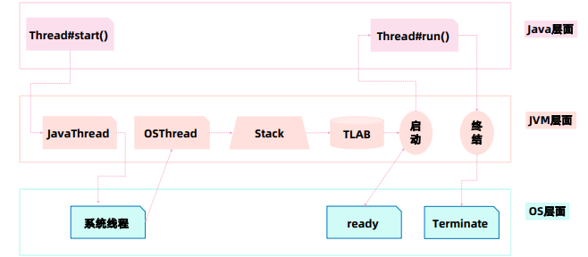
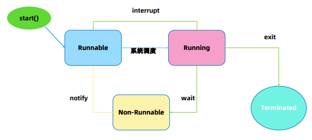
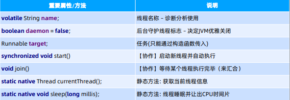
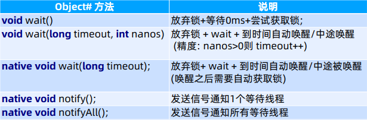
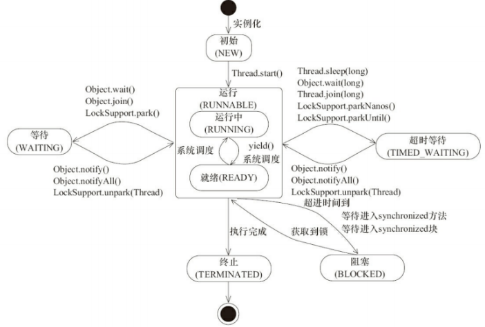
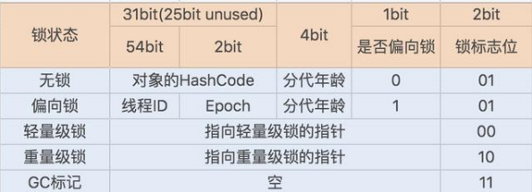
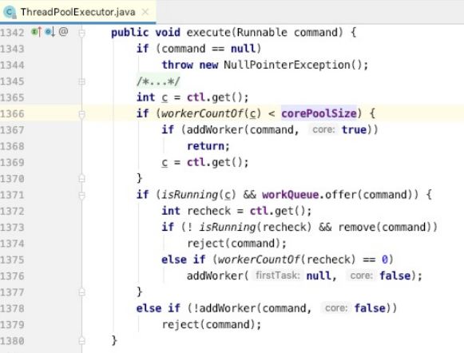

## 并发编程

[toc]

### 1. 多线程基础
#### 多线程的目的：
- 多CPU 核心意味着同时操作系统有更多的并行计算资源可以使用。
- 操作系统以线程作为基本的调度单元。

#### 线程的创建过程



#### 进程与线程的区别：
```
1. 进程是资源分配的最小单位，线程是CPU调度的最小单位
2. 线程在进程下行进，一个进程可以包含多个线程
3. 不同进程间数据很难共享，同一进程下不同线程间数据很易共享
4. 进程要比线程消耗更多的计算机资源
5. 进程间不会相互影响，一个线程挂掉将影响进程

进程和线程都是一个时间段的描述，是CPU工作时间段的描述，不过是颗粒大小不同。
```

#### 线程状态



Thread类的方法





> 辨析:
>
> - Thread.sleep: 释放 CPU
>
> - Object#wait : 释放锁

1. Thread.sleep(long millis)，一定是当前线程调用此方法，当前线程进入 TIMED_WAITING 状态，但不释放对象锁，millis 后线程自动苏醒进入就绪状态。作用：给其它线程执行机会的最佳方式。
2. Thread.yield()，一定是当前线程调用此方法，当前线程放弃获取的 CPU 时间片，但不释放锁资源，由运行状态变为就绪状态，让 OS 再次选择线程。作用：让相同优先级的线程轮流执行，并不保证一定会轮流执行。实际中无法保证yield() 达到让步目的，因为让步的线程还有可能被线程调度程序再次选中。Thread.yield() 不会导致阻塞。该方法与sleep() 类似，只是不能由用户指定暂停多长时间。
3. t.join()/t.join(long millis)，当前线程里调用其它线程 t 的 join 方法，当前线程进入WAITING/TIMED_WAITING 状态，当前线程不会释放已经持有的对象锁。线程t执行完毕或者 millis 时间到，当前线程进入就绪状态。
4. obj.wait()，当前线程调用对象的 wait() 方法，当前线程释放对象锁，进入等待队列。依靠 notify()/notifyAll() 唤醒或者 wait(long timeout) timeout 时间到自动唤醒。
5. obj.notify() 唤醒在此对象监视器上等待的单个线程，选择是任意性的。notifyAll() 唤醒在此对象监视器上等待的所有线程

#### Thread 的中断与异常处理
1. 线程内部自己处理异常，不溢出到外层。
2. 如果线程被 Object.wait, Thread.join 和 Thread.sleep 三种方法之一阻塞，此时调用该线程的interrupt() 方法，那么该线程将抛出一个InterruptedException 中断异常（该线程必须事先预备好处理此异常），从而提早地终结被阻塞状态。如果线程没有被阻塞，这时用interrupt() 将不起作用，直到执行到 wait(),sleep(),join() 时,才马上会抛出InterruptedException。
3. 如果是计算密集型的操作怎么办？

  分段处理，每个片段检查一下状态，是不是要终止。

Thread 状态



### 2. 线程安全

多个线程竞争同一资源时，如果对资源的访问顺序敏感，就称存在竞态条件。

导致竞态条件发生的代码区称作临界区。

不进行恰当的控制，会导致线程安全问题

#### 并发相关的性质

**1. 原子性**：

原子操作，注意跟事务 ACID 里原子性的区别与联系
对基本数据类型的变量的读取和赋值操作是原子性操作，即这些操作是不可被中断的，要么执行，要么不执行。
```java
x = 10;     // 语句一
y = x;      // 语句二
x++;        // 语句三
x = x + 1;  // 语句四
```

只有语句1是原子操作

**2. 可见性**：

对于可见性，Java 提供了 volatile 关键字来保证可见性。

当一个共享变量被 volatile 修饰时，它会保证修改的值会立即被更新到主存，当有其他线程需要读取时，它会去内存中读取新值。

另外，通过 synchronized 和 Lock 也能够保证可见性，synchronized 和 Lock 能保证
同一时刻只有一个线程获取锁然后执行同步代码，并且在释放锁之前会将对变量的修改刷新到主存当中。
volatile 并不能保证原子性。

**3. 有序性**：

Java 允许编译器和处理器对指令进行重排序，但是重排序过程不会影响到单线程程序的执行，却会影
响到多线程并发执行的正确性。可以通过 volatile 关键字来保证一定的“有序性”（synchronized 和 Lock
也可以）。

>happens-before 原则（先行发生原则）：

  ```
  1. 程序次序规则：一个线程内，按照代码先后顺序
  2. 锁定规则：一个 unLock 操作先行发生于后面对同一个锁的 lock 操作
  3. Volatile 变量规则：对一个变量的写操作先行发生于后面对这个变量的读操作
  4. 传递规则：如果操作 A 先行发生于操作 B，而操作 B 又先行发生于操作 C，则可以得出 A 先于 C
  5. 线程启动规则：Thread 对象的 start() 方法先行发生于此线程的每个一个动作
  6. 线程中断规则：对线程 interrupt() 方法的调用先行发生于被中断线程的代码检测到中断事件的发生
  7. 线程终结规则：线程中所有的操作都先行发生于线程的终止检测，我们可以通过 Thread.join() 方法结束、Thread.isAlive() 的返回值手段检测到线程已经终止执行
  8. 对象终结规则：一个对象的初始化完成先行发生于他的 finalize() 方法的开始
  ```
#### synchronized 的实现


1. 使用对象头标记字(Object monitor)
2. Synchronized 方法优化
3. 偏向锁: BiaseLock

  

#### volatile
1. 每次读取都强制从主内存刷数据
2. 适用场景： 单个线程写；多个线程读
3. 原则： 能不用就不用，不确定的时候也不用
4. 替代方案： Atomic 原子操作类
```Java
x = 2;        // 语句1
y = 0;        // 语句2
flag = true;  // 语句3 （假如是 volatile 的）
x = 4;        // 语句4
y = 1;        // 语句5
```
假如语句3的字段是 volatile 的，那么
- 语句1和2，不会被重排到3的后面，4和5也不会到前面。
- 同时可以保证1和2的结果是对3、4、5可见。

### 3. 线程池

1. Excutor: 执行者 – 顶层接口
2. ExcutorService: 接口 API
3. ThreadFactory: 线程工厂
4. Excutors: 工具类

#### Executor – 执行者
| 重要方法                        | 说明             |
| ------------------------------- | ---------------- |
| void execute(Runnable command); | 执行可运行的任务 |

线程池从功能上看，就是一个任务执行器

- submit 方法 -> 有返回值，用 Future 封装
- execute 方法 -> 无返回值

submit 方法还异常可以在主线程中 catch 到。
execute 方法执行任务是捕捉不到异常的。

#### ExecutorService
| 重要方法                                       | 说明                                     |
| ---------------------------------------------- | ---------------------------------------- |
| void execute(Runnable command);                | 执行可运行的任务                         |
| void shutdown();                               | 关闭线程池                               |
| List<Runnable> shutdownNow();                  | 立即关闭                                 |
| Future<?> submit(Runnable task);               | 提交任务; 允许获取执行结果               |
| <T> Future<T> submit(Runnable task, T result); | 提交任务（指定结果）; 控制\|获取执行结果 |
| <T> Future<T> submit(Callable<T> task);        | 提交任务; 允许控制任务和获取执行结果     |

shutdown()：停止接收新任务，原来的任务继续执行

shutdownNow()：停止接收新任务，原来的任务停止执行

awaitTermination(long timeOut, TimeUnit unit)：当前线程阻塞

#### ThreadFactory
| 重要方法                      | 说明       |
| ----------------------------- | ---------- |
| Thread newThread(Runnable r); | 创建新线程 |

ThreadPoolExecutor 提交任务逻辑:
1. 判断 corePoolSize 【创建】
2. 加入 workQueue
3. 判断 maximumPoolSize 【创建】
4. 执行拒绝策略处理器



#### 线程池参数

缓冲队列

> BlockingQueue 是双缓冲队列。BlockingQueue 内部使用两条队列，允许两个线程同时向队列一个存储，一个取出操作。在保证并发安全的同时，提高了队列的存取效率。

1. ArrayBlockingQueue:规定大小的 BlockingQueue，其构造必须指定大小。其所含的对象是 FIFO 顺序排序的。
2. LinkedBlockingQueue:大小不固定的 BlockingQueue，若其构造时指定大小，生成的 BlockingQueue 有大小限制，不指定大小，其大小有Integer.MAX_VALUE 来决定。其所含的对象是 FIFO 顺序排序的。
3. PriorityBlockingQueue:类似于 LinkedBlockingQueue，但是其所含对象的排序不是 FIFO，而是依据对象的自然顺序或者构造函数的Comparator 决定。
4. SynchronizedQueue:特殊的 BlockingQueue，对其的操作必须是放和取交替完成。

拒绝策略

1. ThreadPoolExecutor.AbortPolicy:丢弃任务并抛出 RejectedExecutionException异常。(默认)
2. ThreadPoolExecutor.DiscardPolicy：丢弃任务，但是不抛出异常。
3. ThreadPoolExecutor.DiscardOldestPolicy：丢弃队列最前面的任务，然后重新提交被拒绝的任务
4. ThreadPoolExecutor.CallerRunsPolicy：由调用线程（提交任务的线程）处理该任务

#### ThreadPoolExecutor

| 重要方法                           | 说明           |
| ---------------------------------- | -------------- |
| int corePoolSize;                  | 核心线程数     |
| int maximumPoolSize;               | 最大线程数     |
| ThreadFactory threadFactory;       | 线程创建工厂   |
| BlockingQueue<Runnable> workQueue; | 工作队列       |
| RejectedExecutionHandler handler;  | 拒绝策略处理器 |
| void execute(Runnable command)     | 执行           |
| Future<?> submit(Runnable task)    | 提交任务       |
| submit(Runnable task, T result)    | 提交任务       |
| submit(Callable<T> task)           | 提交任务       |

##### 创建线程池方法

- newSingleThreadExecutor

> 创建一个单线程的线程池。这个线程池只有一个线程在工作，也就是相当于单线程串行执行所有任务。如果这个唯一的线程因为异常结束，那么会有一个新的线程来替代它。此线程池保证所有任务的执行顺序按照任务的提交顺序执行。

- newFixedThreadPool

> 创建固定大小的线程池。每次提交一个任务就创建一个线程，直到线程达到线程池的最大大小。线程池的大小一旦达到最大值就会保持不变，如果某个线程因为执行异常而结束，那么线程池会补充一个新线程。

```
坑点：其队列大小无限，核心线程数与最大线程数一致，可以无限制的接收任务，导致OOM
```

- newCachedThreadPool

> 创建一个可缓存的线程池。如果线程池的大小超过了处理任务所需要的线程，那么就会回收部分空闲（60秒不执行任务）的线程，当任务数增加时，此线程池又可以智能的添 加新线程来处理任务。此线程池不会对线程池大小做限制，线程池大小完全依赖于操作系统（或者说JVM）能够创建的最大线程大小。

```
 坑点：可以无限制的创建线程，直到JVM达到最大内存
```
- newScheduledThreadPool

> 创建一个大小无限的线程池。此线程池支持定时以及周期性执行任务的需求。

#### Callable 与 Future
Callable – 基础接口

| 重要方法                   | 说明     |
| -------------------------- | -------- |
| V call() throws Exception; | 调用执行 |

对比:

- Runnable#run()没有返回值
- Callable#call()方法有返回值

Future – 基础接口

| 重要方法 | 说明 |
| -------- | ---- |
| boolean cancel(boolean mayInterruptIfRunning);| 取消任务（执行时是否打断）|
| boolean isCancelled(); | 是否被取消|
| boolean isDone(); | 是否执行完毕|
| V get() throws InterruptedException,ExecutionException;| 获取执行结果|
| V get(long timeout, TimeUnitunit)throws InterruptedException,ExecutionException,TimeoutException;| 限时获取执行结果|
