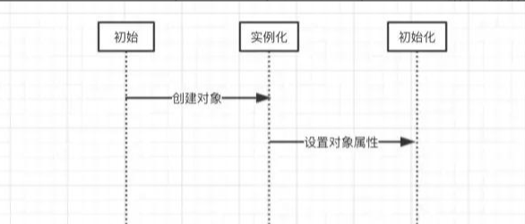
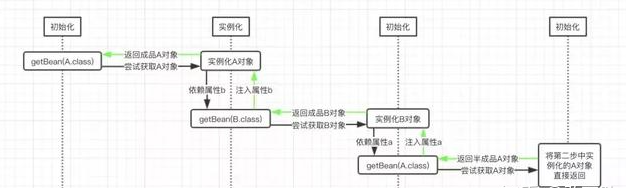
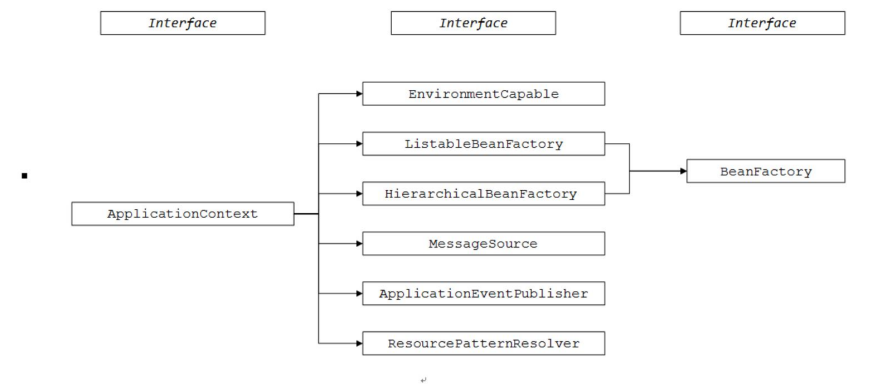
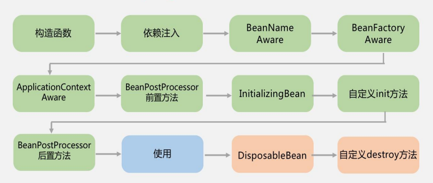
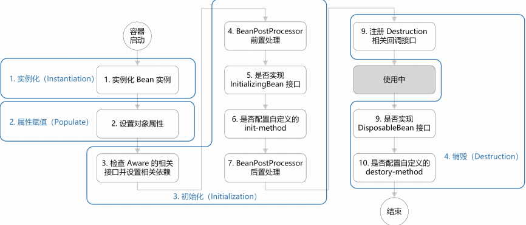
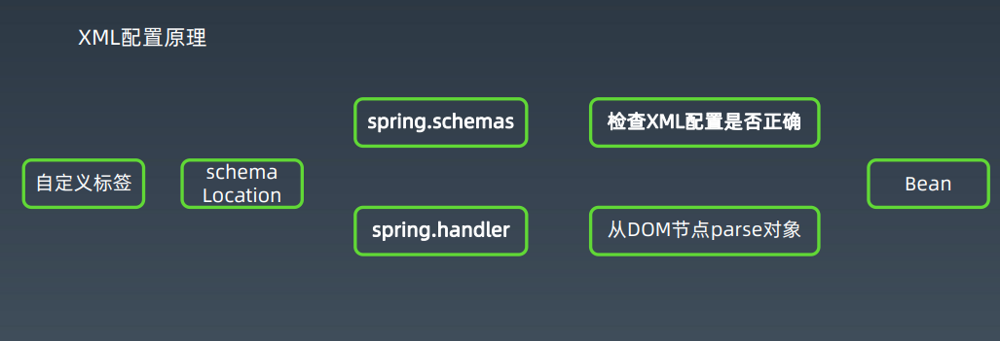

### 1. Spring framework 6大模块
1. Core：Bean/Context/AOP
2. Testing：Mock/TestContext
3. DataAccess: Tx/JDBC/ORM
4. Spring MVC/WebFlux: web

5. Integration: remoting/JMS/WS
6. Languages: Kotlin/Groovy

  > 1，2，3，4为常用模块

  引入Spring意味着引入了一种研发协作模式

### 2. Spring AOP详解

 AOP-面向切面编程：

> Spring早期版本的核心功能，管理对象生命周期与对象装配。为了实现管理和装配，一个自然而然的想法就是，加一个中间层代理（字节码增强）来实现所有对象的托管。

IoC-控制反转:
> 也称为DI（Dependency Injection）依赖注入。
>
> 对象装配思路的改进。
  从对象A直接引用和操作对象B，变成对象A里指需要依赖一个接口IB，系统启动和装配阶段，把IB接口的实例对象注入到对象A，这样A就不需要依赖一个IB接口的具体实现，也就是类B。
>
> 从而可以实现在不修改代码的情况，修改配置文件，即可以运行时替换成注入IB接口另一实现类C的一个对象实例。

##### spring如何解决循环依赖：

   关于Spring bean的创建，其本质上还是一个对象的创建，既然是对象，一定要明白一点就是，一个完整的对象包含两部分：
   - 当前对象实例化
   - 对象属性的实例化。

   在Spring中，对象的实例化是通过反射实现的，而对象的属性则是在对象实例化之后通过一定的方式设置的。

   

   如下是A和B的声明：

   ```java
    @Component
    public class A {
        private B b;
        public void setB(B b) {
          this.b = b;
        }
    }
    @Component
    public class B {
        private A a;
        public void setA(A a) {
            this.a = a;
        }
    }
   ```
   这里A和B中各自都以对方为自己的全局属性。这里首先需要说明的一点，Spring实例化bean是通过ApplicationContext.getBean()方法来进行的。

   如果要获取的对象依赖了另一个对象，那么其首先会创建当前对象，然后通过递归的调用ApplicationContext.getBean()方法来获取所依赖的对象，最后将获取到的对象注入到当前对象中。

     1. Spring尝试通过ApplicationContext.getBean()方法获取A对象的实例，由于Spring容器中还没有A对象实例，因而其会创建一个A对象
     2. 然后发现其依赖了B对象，因而会尝试递归的通过ApplicationContext.getBean()方法获取B对象的实例
     3. 但是Spring容器中此时也没有B对象的实例，因而其还是会先创建一个B对象的实例。
        > 注意这个时间点，此时A对象和B对象都已经创建了，并且保存在Spring容器中了，只不过A对象的属性b和B对象的属性a都还没有设置进去。
     4. 在前面Spring创建B对象之后，Spring发现B对象依赖了属性A，因而还是会尝试递归的调用ApplicationContext.getBean()方法获取A对象的实例
     5. 因为Spring中已经有一个A对象的实例，虽然只是半成品（其属性b还未初始化），但其也还是目标bean，因而会将该A对象的实例返回
     6. 此时，B对象的属性a就设置进去了，然后还是ApplicationContext.getBean()方法递归的返回，也就是将B对象的实例返回，此时就会将该实例设置到A对象的属性b中。
     7. 这个时候，A对象的属性b和B对象的属性a都已经设置了目标对象的实例了

      

      图中getBean()表示调用Spring的ApplicationContext.getBean()方法，而该方法中的参数，则表示我们要尝试获取的目标对象。

  注意：通过构造器注入构成的循环依赖，此依赖是无法解决的，只能抛出BeanCurrentlyIn CreationException异常表示循环依赖

代理方式：

1. 接口类型

    默认使用JdkProxy  ------ com.sun.proxy.$Proxy

    proxyTargetClass ------ EnhancerBySpringCGLIB

    JDK动态代理只能对实现了接口的类生成代理，而不能针对类

2. 非接口类型

  默认使用CGlib ------ EnhancerBySpringCGLIB

  CGLIB是针对类实现代理，主要是对指定的类生成一个子类，覆盖其中的方法

  > Cglib和jdk动态代理的区别？

  1. Jdk动态代理：利用拦截器（必须实现InvocationHandler）加上反射机制生成一个代理接口的匿名类，在调用具体方法前调用InvokeHandler来处理
  2. Cglib动态代理：利用ASM框架，对代理对象类生成的class文件加载进来，通过修改其字节码生成子类来处理

  > 什么时候用cglib什么时候用jdk动态代理？

  1. 目标对象生成了接口 默认用JDK动态代理
  2. 如果目标对象使用了接口，可以强制使用cglib
  3. 如果目标对象没有实现接口，必须采用cglib库，Spring会自动在JDK动态代理和cglib之间转换

  > JDK动态代理和cglib字节码生成的区别？

  1. JDK动态代理只能对实现了接口的类生成代理，而不能针对类
  2. Cglib是针对类实现代理，主要是对指定的类生成一个子类，覆盖其中的方法，并覆盖其中方法的增强，但是因为采用的是继承，所以该类或方法最好不要生成final，对于final类或方法，是无法继承的

  > Cglib比JDK快？

  1. cglib底层是ASM字节码生成框架，但是字节码技术生成代理类，在JDL1.6之前比使用java反射的效率要高
  2. 在jdk6之后逐步对JDK动态代理进行了优化，在调用次数比较少时效率高于cglib代理效率
  3. 只有在大量调用的时候cglib的效率高，但是在1.8的时候JDK的效率已高于cglib
  4. Cglib不能对声明final的方法进行代理，因为cglib是动态生成代理对象，final关键字修饰的类不可变只能被引用不能被修改

  > Spring如何选择是用JDK还是cglib？

  1. 当bean实现接口时，会用JDK代理模式
  2. 当bean没有实现接口，用cglib实现
  3. 可以强制使用cglib（在spring配置中加入<aop:aspectj-autoproxy proxyt-target-class=”true”/>）

  > 对比：

  ```
    /**
     *  Cglib的第三方库提供的动态代理
     *
     * 动态代理：
     *  特点：字节码随用随创建，随用随加载
     *  作用：不修改源码的基础上对方法增强
     *  分类：
     *      基于接口的动态代理
     *      基于子类的动态代理
     *  基于子类的动态代理：
     *      涉及的类：Enhancer
     *      提供者：第三方cglib库
     *  如何创建代理对象：
     *      使用Enhancer类中的create方法
     *  创建代理对象的要求：
     *      被代理类不能是最终类
     *  newProxyInstance方法的参数：在使用代理时需要转换成指定的对象
     *      ClassLoader:类加载器
     *          他是用于加载代理对象字节码的。和被代理对象使用相同的类加载器。固定写法
     *      Callback：用于提供增强的代码
     *          他是让我们写如何代理。我们一般写一个该接口的实现类，通常情况加都是匿名内部类，但不是必须的。
     *          此接口的实现类，是谁用谁写。
     *          我们一般写的都是该接口的子接口实现类，MethodInterceptor
     */
  ```

  ```
    /**
     *  JDK本身提供的动态代理实现
     *
     * 动态代理：
     *  特点：字节码随用随创建，随用随加载
     *  作用：不修改源码的基础上对方法增强
     *  分类：
     *      基于接口的动态代理
     *      基于子类的动态代理
     *  基于接口的动态代理：
     *      涉及的类：proxy
     *      提供者：Jdk官方
     *  如何创建代理对象：
     *      使用Proxy类中的newProxyInstance方法
     *  创建代理对象的要求：
     *      被代理类最少实现一个接口，如果没有则不能使用
     *  newProxyInstance方法的参数：在使用代理时需要转换成指定的对象
     *      ClassLoader:类加载器
     *          他是用于加载代理对象字节码的。和被代理对象使用相同的类加载器。固定写法
     *      Class[]：字节码数组
     *          它是用于让代理对象和被代理对象有相同方法。固定写法
     *      InvocationHandler：用于提供增强的代码
     *          他是让我们写如何代理。我们一般写一个该接口的实现类，通常情况加都是匿名内部类，但不是必须的。
     *          此接口的实现类，是谁用谁写。
     */
  ```
|                  | cglib        | JDK |
| ---------------- | ------------ | --- |
| 是否提供子类代理 | 是           | 否  |
| 是否提供接口代理 | 是（可强制） | 是  |
| 区别                 |    必须依赖于CGLib的类库，但是它需要类来实现任何接口代理的是指定的类生成一个子类，覆盖其中的方法          |    实现InvocationHandler 使用Proxy.newProxyInstance产生代理对象被代理的对象必须要实现接口 |

### 3. Spring Bean核心原理*
  #### 3.1 Spring Bean生命周期
  Bean的加载过程

  

  

  

Bean的加载过程

  1. 创建对象
  2. 属性赋值
  3. 初始化
  4. 注销接口注册

#### 3.2 Spring XML配置原理



自动化XML配置工具：

XmlBeans -> Spring-xbean

2个原理：
  - 1、根据Bean的字段结构，自动生成XSD
  - 2、根据Bean的字段结构，配置XML文件
