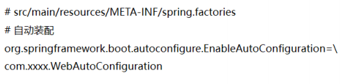

### springboot的诞生
1. 设计的出发点：一切都是为了简化
  - 让开发变简单：
  - 让配置变简单：
  - 让运行变简单：

2. 基于什么变简单：

  - 约定大于配置

3. 为什么能做到简化：
  - 1、Spring 本身技术的成熟与完善，各方面第三方组件的成熟集成
  - 2、Spring 团队在去 web 容器化等方面的努力
  - 3、基于 MAVEN 与 POM 的 Java 生态体系，整合 POM 模板成为可能
  - 4、避免大量 maven 导入和各种版本冲突

> Spring Boot 是 Spring 的一套快速配置脚手架，关注于自动配置，配置驱动。

### 什么是 Spring Boot

Spring Boot 使创建独立运行、生产级别的 Spring 应用变得容易，你可以直接运行它。我们对 Spring 平台和第三方库采用限定性视角，以此让大家能在最小的成本下上手。大部分 Spring Boot 应用仅仅需要最少量的配置

功能特性:
  1. 创建独立运行的 Spring 应用
  2. 直接嵌入 Tomcat 或 Jetty，Undertow，无需部署 WAR 包
  3. 提供限定性的 starter 依赖简化配置（就是脚手架）
  4. 在必要时自动化配置 Spring 和其他三方依赖库
  5. 提供生产 production-ready 特性，例如指标度量，健康检查，外部配置等
  6. 完全零代码生产和不需要 XML 配置

### Spring Boot 核心原理*

两大核心原理:
  - 自动化配置:

    简化配置核心
    基于 Configuration，EnableXX，Condition
  - spring-boot-starter:

    脚手架核心
    整合各种第三方类库，协同工具

为什么要约定大于配置:

优势在于，开箱即用：

  - 1.Maven 的目录结构：默认有 resources 文件夹存放配置文件。默认打包方式为 jar。
  - 2.默认的配置文件：application.properties 或 application.yml 文件
  - 3.默认通过 spring.profiles.active 属性来决定运行环境时的配置文件。
  - 4.EnableAutoConfiguration 默认对于依赖的 starter 进行自动装载。
  - 5.spring-boot-start-web 中默认包含 spring-mvc 相关依赖以及内置的 web容器，使得构建一个 web 应用更加简单。

自动化配置原理:

  

  

  

  

#### Spring Boot 自动配置注解

- @SpringBootApplication

    SpringBoot 应用标注在某个类上说明这个类是 SpringBoot 的主配置类，SpringBoot 就会运行这个类的 main 方法来启动 SpringBoot 项目。

    - @SpringBootConfiguration
    - @EnableAutoConfiguration
    - @AutoConfigurationPackage
    - @Import({AutoConfigurationImportSelector.class})

    加载所有 META-INF/spring.factories 中存在的配置类（类似 SpringMVC 中加载所有 converter）

条件化自动配置

- @ConditionalOnBean
- @ConditionalOnClass
- @ConditionalOnMissingBean
- @ConditionalOnProperty
- @ConditionalOnResource
- @ConditionalOnSingleCandidate
- @ConditionalOnWebApplication

### JDBC 与 ORM

JDBC 定义了数据库交互接口：
  - DriverManager
  - Connection
  - Statement
  - ResultSet

后来又加了DataSource--Pool

#### Hibernate
Hibernate 是一个开源的对象关系映射框架，它对JDBC 进行了非常轻量级的对象封装，它将 POJO 与数据库表建立映射关系，是一个全自动的 orm 框架，hibernate 可以自动生成 SQL 语句，自动执行，使得 Java 程序员可以使用面向对象的思维来操纵数据库。

Hibernate 里需要定义实体类和 hbm 映射关系文件（IDE 一般有工具生成）。

Hibernate 里可以使用 HQL、Criteria、Native SQL三种方式操作数据库。也可以作为 JPA 适配实现，使用 JPA 接口操作。

#### MyBatis - 半自动化 ORM

支持定制化 SQL、存储过程以及高级映射。MyBatis 避免了几乎所有的JDBC 代码和手动设置参数以及获取结果集。MyBatis 可以使用简单的 XML或注解来配置和映射原生信息，将接口和 Java 的 POJOs(Plain Old JavaObjects,普通的 Java 对象)映射成数据库中的记录。

 1. 需要使用映射文件 mapper.xml 定义 map规则和 SQL
 2. 需要定义 mapper/DAO，基于 xml 规则，操作数据库

可以使用工具生成基础的 mapper.xml 和 mapper/DAO

一个经验就是，继承生成的 mapper，而不是覆盖掉，也可以直接在 mapper 上用注解方式配置 SQL

MyBatis 与 Hibernate 比较：

Mybatis 优点：原生 SQL（XML 语法），直观，对 DBA 友好

Hibernate 优点：简单场景不用写 SQL（HQL、Cretiria、SQL）

Mybatis 缺点：繁琐，可以用 MyBatis-generator、MyBatis-Plus 之类的插件

Hibernate 缺点：对 DBA 不友好

### Spring 管理事务

JDBC 层，数据库访问层，怎么操作事务？
> 编程式事务管理

Spring 怎么做到无侵入实现事务？
>声明式事务管理：事务管理器+AOP

事物传播机制

| 类型           | 参数名                      | 解释                                                                                            |
| -------------- | --------------------------- | ----------------------------------------------------------------------------------------------- |
| 支持当前事务   | Propagation. REQUIRED(默认) | 如果当前没有事务，就新建一个事务，如果有事务，就加入其中                                        |
| 支持当前事务   | Propagation.SUPPORTS        | 支持当前事务，如果没有事务，则以非事务的形式执行                                                |
| 支持当前事务   | Propagation.MANDATORY       | 支持当前事务，如果没有事务，就抛出异常                                                          |
| 不支持当前事务 | Propagation.REQUIRES_NEW    | 新建事务，如果存在事务，就将事务挂起，新建一个事务                                              |
| 不支持当前事务 | Propagation.NOT_SUPPORTED   | 以非事务的方式执行，当前存在事务，就把当前事务挂起                                              |
| 不支持当前事务 | Propagation.NEVER           | 以非事务的方式执行，如果当前有事务，则抛出异常                                                  |
| 事务嵌套       | Propagation.NESTED          | 如果当前存在事务，则在嵌套事务中执行；如果当前没有事务，则执行与Propagation. REQUIRED类似的操作 |

其中常用的事务传播机制有：

- Propagation. REQUIRED：默认
- Propagation.NOT_SUPPORTED：用于新业务不影响主体业务逻辑，及时业务执行异常也不会影响主体业务逻辑
- Propagation.REQUIRES_NEW：一般用于记录业务日志

Propagation.NESTED 是较为难理解的事务隔离： 当前存在事务时，会发生嵌套事务，会在子方法执行前，加入SavePoint， 当子事务回滚时，会回到当前点，主体逻辑不会回滚，只有当主业务提交之后，才会全部提交。

注意Spring 事务控制是根据捕获异常信息来处理的，如在业务中捕获了异常会造成事务回滚失败；但是Spring捕获异常后不会处理异常，会继续向上抛出，开启多个事务时，也需要try-catch 的使用，避免异常上抛，导致其他事务回滚，逻辑执行异常。

隔离级别：isolation

| 参数值                      | 名称     | 解释                                             |
| --------------------------- | -------- | ------------------------------------------------ |
| Isolation. DEFAULT          | Default  | 默认的事务隔离级别，默认是用数据库的事务隔离级别 |
| Isolation. READ_UNCOMMITTED | 未提交读 | 脏读，不可重复读、幻读都存在                     |
| Isolation. READ_COMMITTED   | 已提交读 | 避免脏读，但是存在不可重复读，幻读               |
| Isolation. REPEATABLE_READ  | 可重复读 | 避免脏读和不可重复读，但是有幻读的可能           |
| Isolation. SERIALIZABLE     | 串行话   | 避免以上所有读的问题                             |

- 脏读：指一个事务读取了一个未提交事务的数据

- 不可重复读：在一个事务内读取表中的某一行数据,多次读取结果不同.一个事务读取到了另一个事务提交后的数据.

- 虚读(幻读)：在一个事务内读取了别的事务插入的数据，导致前后读取不一致(insert)

Spring 声明式事务配置参考:

事务的传播性：
> @Transactional(propagation=Propagation.REQUIRED)

事务的隔离级别：
>@Transactional(isolation = Isolation.READ_UNCOMMITTED)
>
> 读取未提交数据(会出现脏读, 不可重复读) 基本不使用

只读：
> @Transactional(readOnly=true)
>
>该属性用于设置当前事务是否为只读事务，设置为 true 表示只读，false 则表示可读写，默认值为 false。

事务的超时性：
> @Transactional(timeout=30)

回滚：
>指定单一异常类：@Transactional(rollbackFor=RuntimeException.class)
>
>指定多个异常类：@Transactional(rollbackFor={RuntimeException.class, Exception.class})
