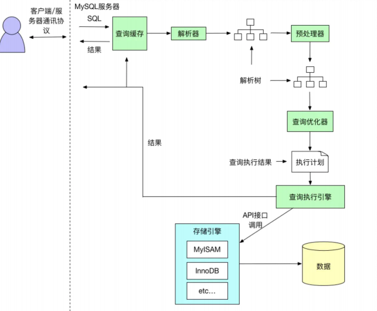
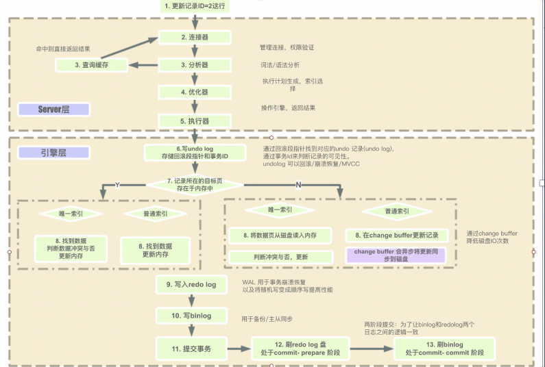
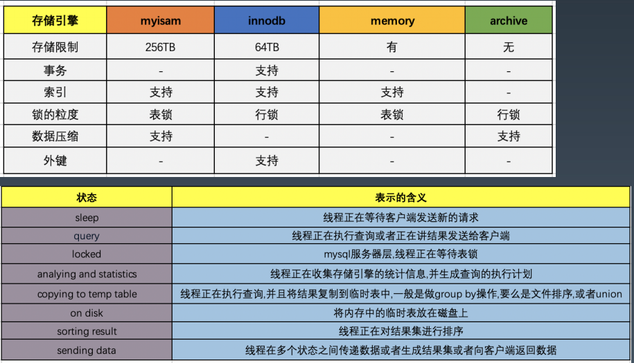
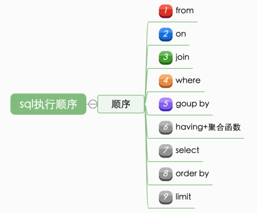
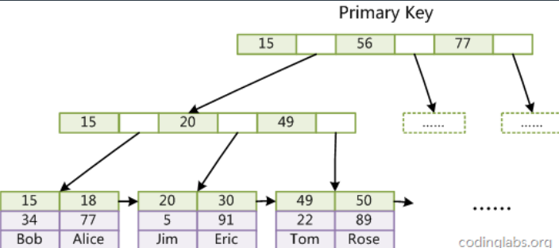

### 1. 数据库设计范式
   - 第一范式（1NF）：关系 R 属于第一范式，当且仅当R中的每一个属性A的值域只包含原子项
   - 第二范式（2NF）：在满足 1NF 的基础上，消除非主属性对码的部分函数依赖
   - 第三范式（3NF）：在满足 2NF 的基础上，消除非主属性对码的传递函数依赖
   - BC 范式（BCNF）：在满足 3NF 的基础上，消除主属性对码的部分和传递函数依赖
   - 第四范式（4NF）：消除非平凡的多值依赖
   - 第五范式（5NF）：消除一些不合适的连接依赖

### 2. 常见关系数据库
   - 开源：MySQL、PostgreSQL
   - 商业：Oracle，DB2，SQL Server
   - 内存数据库：Redis？，VoltDB
   - 图数据库：Neo4j，Nebula
   - 时序数据库：InfluxDB、openTSDB
   - 其他关系数据库：Access、Sqlite、H2、Derby、Sybase、Infomix 等
   - NoSQL 数据库：MongoDB、Hbase、Cassandra、CouchDB
   - NewSQL/ 分布式数据库：TiDB、CockroachDB、NuoDB、OpenGauss、OB、TDSQL

### 3. SQL 语言
   1. 数据查询语言（DQL: Data Query Language）：其语句，也称为“数据检索语句”，用以从表
   中获得数据，确定数据怎样在应用程序给出。保留字 SELECT 是 DQL（也是所有 SQL）用得最多
   的动词，其他 DQL 常用的保留字有 WHERE，ORDER BY，GROUP BY 和 HAVING。这些 DQL 保
   留字常与其它类型的 SQL 语句一起使用。
   2. 数据操作语言（DML：Data Manipulation Language）：其语句包括动词 INSERT、
   UPDATE 和 DELETE。它们分别用于添加、修改和删除。
   3. 事务控制语言（TCL）：它的语句能确保被 DML 语句影响的表的所有行及时得以更新。包括
   COMMIT（提交）命令、SAVEPOINT（保存点）命令、ROLLBACK（回滚）命令。
   4. 数据控制语言（DCL）：它的语句通过 GRANT 或 REVOKE 实现权限控制，确定单个用户和用
   户组对数据库对象的访问。某些 RDBMS 可用 GRANT 或 REVOKE 控制对表单个列的访问。
   5. 数据定义语言（DDL）：其语句包括动词 CREATE,ALTER 和 DROP。在数据库中创建新表或修
   改、删除表（CREAT TABLE 或 DROP TABLE）；为表加入索引等。
   6. 指针控制语言（CCL）：它的语句，像 DECLARE CURSOR，FETCH INTO 和 UPDATE WHERE
   CURRENT 用于对一个或多个表单独行的操作。

### 4. MySQL 的版本
   - 4.0支持 InnoDB，事务
   - 2003年，5.0
   - 5.6 ==> 历史使用最多的版本
   - 5.7 ==> 近期使用最多的版本
   - 8.0 ==>最新和功能完善的版本
   - 5.6/5.7的差异

       5.7支持：
       - 多主
       - MGR 高可用
       - 分区表
       - json
       - 性能
       - 修复 XA 等
   - 5.7/8.0的差异
       - 通用表达式
       - 窗口函数
       - 持久化参数
       - 自增列持久化
       - 默认编码 utf8mb4
       - DDL 原子性
       - JSON 增强
       - 不再对 group by 进行隐式排序？？==> 坑

### 5. MySQL 存储
   独占模式
   1. 日志组文件：ib_logfile0和ib_logfile1，默认均为5M
   2. 表结构文件：*.frm
   3. 独占表空间文件：*.ibd
   4. 字符集和排序规则文件：db.opt
   5. binlog 二进制日志文件：记录主数据库服务器的 DDL 和 DML 操作
   6. 二进制日志索引文件：master-bin.index

   共享模式 innodb_file_per_table=1
   1. 数据都在 ibdata1

### 6. MySQL 简化执行流程
  

### 7. MySQL 详细执行流程
  

### 8. MySQL 执行引擎和状态
  

### 9. MySQL 对 SQL 执行顺序
  

  实际上这个过程也并不是绝对这样的，中间 mysql 会有部分的优化以达到最佳的优化效果，比如在 select 筛选出找到的数据集

### 10. MySQL 索引原理

  

  数据是按页来分块的，当一个数据被用到时，其附近的数据也通常会马上被使用。

  InnoDB 使用 B+ 树实现聚集索引

### 11. 参数配置优化
查看参数配置
- show variables like xxx

1. 连接请求的变量
  1. max_connections
  2. back_log
  3. wait_timeout和interative_timeout
2. 缓冲区变量
  1. 4、key_buffer_size
  2. query_cache_size（查询缓存简称 QC)
  3. max_connect_errors：
  4. sort_buffer_size：
  5. max_allowed_packet=32M
  6. join_buffer_size=2M
  7. thread_cache_size=300
3. 配置 Innodb 的几个变量
  1. innodb_buffer_pool_size
  2. innodb_flush_log_at_trx_commit
  3. innodb_thread_concurrency=0
  4. innodb_log_buffer_size
  5. innodb_log_file_size=50M
  6. innodb_log_files_in_group=3
  7. read_buffer_size=1M
  8. read_rnd_buffer_size=16M
  9. bulk_insert_buffer_size=64M
  10. binary log

### 12. MySQL 数据库设计优化-最佳实践
- 如何恰当选择引擎？
- 库表如何命名？
- 如何合理拆分宽表？
- 如何选择恰当数据类型：明确、尽量小
- char、varchar 的选择
- （text/blob/clob）的使用问题？
- 文件、图片是否要存入到数据库？
- 时间日期的存储问题？
- 数值的精度问题？
- 是否使用外键、触发器？
- 唯一约束和索引的关系？
- 是否可以冗余字段？
- 是否使用游标、变量、视图、自定义函数、存储过程？
- 自增主键的使用问题？
- 能够在线修改表结构（DDL 操作）？
- 逻辑删除还是物理删除？
- 要不要加 create_time,update_time 时间戳？
- 数据库碎片问题？
- 如何快速导入导出、备份数据？
